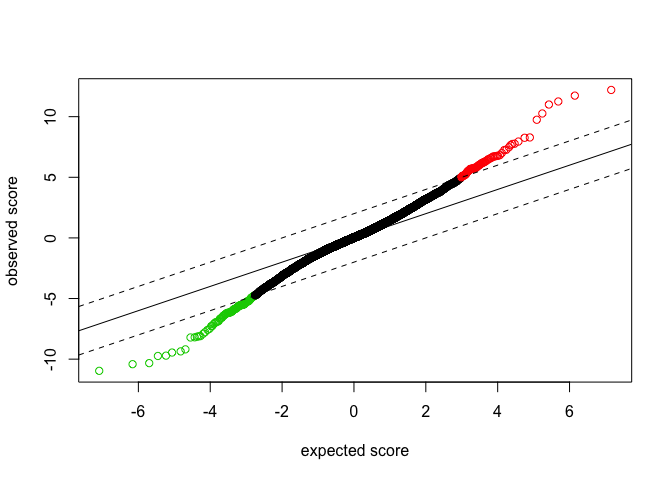

# GSE28521_DEG_CS

## 1. Load data


```r
getwd()
```

```
## [1] "/Users/neurochoi/Study/BioNetwork/GSE28521"
```

```r
setwd("~/Study/BioNetwork/GSE28521")

data <- read.table("normalized_GSE28521.csv", sep =",", row.names = 1, header = TRUE)
head(data)
```

```
##                        ID
## ILMN_1809034 ILMN_1809034
## ILMN_1660305 ILMN_1660305
## ILMN_1762337 ILMN_1762337
## ILMN_2055271 ILMN_2055271
## ILMN_1814316 ILMN_1814316
## ILMN_2359168 ILMN_2359168
##                                                     Gene.title Gene.symbol
## ILMN_1809034    glutamyl-tRNA(Gln) amidotransferase, subunit C        GATC
## ILMN_1660305                              phosphodiesterase 12       PDE12
## ILMN_1762337           metastasis associated in colon cancer 1       MACC1
## ILMN_2055271                            alpha-1-B glycoprotein        A1BG
## ILMN_1814316 RNA binding protein, fox-1 homolog (C. elegans) 1      RBFOX1
## ILMN_2359168 RNA binding protein, fox-1 homolog (C. elegans) 1      RBFOX1
##                   ASD4      ASD9     ASD10      CON1      CON2      CON6
## ILMN_1809034  9.024746  8.528206  8.670555  8.802473  8.848554  8.498980
## ILMN_1660305  9.641773  9.721622  9.812939  9.770373  9.857230 10.030322
## ILMN_1762337  8.202238  8.271332  8.296198  8.283088  8.320767  8.343154
## ILMN_2055271  8.396732  8.500302  8.401248  8.713424  8.408196  8.461209
## ILMN_1814316 10.883035 11.079732 10.844028 11.200983 11.120638 11.284302
## ILMN_2359168 10.908799 11.116369 10.580722 11.098101 11.139998 11.190892
```

## 2. grouping


```r
Sample <- data[,c(4:9)]
Sample <- as.matrix(Sample)

l = c(1,1,1,2,2,2)          # grouping 1 = ASD, 2 = CON
g = factor(l)               # group 추출
```


## 3. samr


```r
library(samr)     					# SAM package loading
```

```
## Loading required package: impute
## Loading required package: matrixStats
## matrixStats v0.14.0 (2015-02-13) successfully loaded. See ?matrixStats for help.
```

```r
sg = sub("0","2",l)					# grouping
sm= list(x = Sample, y= sg, logged2=TRUE)			# SAM input matrix
st = samr(sm,resp.type="Two class unpaired",nperm=100)	# sam test
```

```
## perm= 1
## perm= 2
## perm= 3
## perm= 4
## perm= 5
## perm= 6
## perm= 7
## perm= 8
## perm= 9
## perm= 10
## perm= 11
## perm= 12
## perm= 13
## perm= 14
## perm= 15
## perm= 16
## perm= 17
## perm= 18
## perm= 19
## perm= 20
## perm= 21
## perm= 22
## perm= 23
## perm= 24
## perm= 25
## perm= 26
## perm= 27
## perm= 28
## perm= 29
## perm= 30
## perm= 31
## perm= 32
## perm= 33
## perm= 34
## perm= 35
## perm= 36
## perm= 37
## perm= 38
## perm= 39
## perm= 40
## perm= 41
## perm= 42
## perm= 43
## perm= 44
## perm= 45
## perm= 46
## perm= 47
## perm= 48
## perm= 49
## perm= 50
## perm= 51
## perm= 52
## perm= 53
## perm= 54
## perm= 55
## perm= 56
## perm= 57
## perm= 58
## perm= 59
## perm= 60
## perm= 61
## perm= 62
## perm= 63
## perm= 64
## perm= 65
## perm= 66
## perm= 67
## perm= 68
## perm= 69
## perm= 70
## perm= 71
## perm= 72
## perm= 73
## perm= 74
## perm= 75
## perm= 76
## perm= 77
## perm= 78
## perm= 79
## perm= 80
## perm= 81
## perm= 82
## perm= 83
## perm= 84
## perm= 85
## perm= 86
## perm= 87
## perm= 88
## perm= 89
## perm= 90
## perm= 91
## perm= 92
## perm= 93
## perm= 94
## perm= 95
## perm= 96
## perm= 97
## perm= 98
## perm= 99
## perm= 100
```

```r
dt = samr.compute.delta.table(st)			# delta table 작성 Computes tables of thresholds, cutpoints and corresponding False Discovery rates for SAM analysis
```

```
## 
## Computing delta table
## 1
## 2
## 3
## 4
## 5
## 6
## 7
## 8
## 9
## 10
## 11
## 12
## 13
## 14
## 15
## 16
## 17
## 18
## 19
## 20
## 21
## 22
## 23
## 24
## 25
## 26
## 27
## 28
## 29
## 30
## 31
## 32
## 33
## 34
## 35
## 36
## 37
## 38
## 39
## 40
## 41
## 42
## 43
## 44
## 45
## 46
## 47
## 48
## 49
## 50
```

```r
dt
```

```
##             delta # med false pos 90th perc false pos # called median FDR
##  [1,] 0.000000000    1.816625e+04        18455.329202    23493 0.77326237
##  [2,] 0.002327292    1.800993e+04        18318.017908    23316 0.77242801
##  [3,] 0.009309169    1.768315e+04        18085.107160    23019 0.76819799
##  [4,] 0.020945629    1.721183e+04        17747.641874    22595 0.76175390
##  [5,] 0.037236674    1.578059e+04        16686.307266    21304 0.74073352
##  [6,] 0.058182303    1.398957e+04        15369.752752    19642 0.71222737
##  [7,] 0.083782517    1.182700e+04        13796.328712    17584 0.67259985
##  [8,] 0.114037315    9.641641e+03        12126.598239    15439 0.62449905
##  [9,] 0.148946697    7.482994e+03        10401.330531    13238 0.56526622
## [10,] 0.188510663    5.649559e+03         8801.355451    11199 0.50446991
## [11,] 0.232729213    4.370710e+03         7623.604746     9732 0.44910703
## [12,] 0.281602348    3.291386e+03         6501.077061     8349 0.39422521
## [13,] 0.335130067    2.361314e+03         5444.534209     6991 0.33776489
## [14,] 0.393312370    1.680257e+03         4538.813830     5825 0.28845607
## [15,] 0.456149258    1.159448e+03         3731.285167     4800 0.24155162
## [16,] 0.523640730    8.122419e+02         3088.718584     4010 0.20255408
## [17,] 0.595786786    5.600855e+02         2552.199054     3319 0.16875129
## [18,] 0.672587426    3.739141e+02         2117.798907     2721 0.13741788
## [19,] 0.754042651    2.533346e+02         1730.530784     2228 0.11370495
## [20,] 0.840152460    1.626055e+02         1399.821088     1789 0.09089183
## [21,] 0.930916853    1.190084e+02         1170.445242     1514 0.07860526
## [22,] 1.026335831    8.012444e+01          976.418413     1246 0.06430533
## [23,] 1.126409392    5.420183e+01          782.391584     1007 0.05382505
## [24,] 1.231137538    3.338518e+01          629.212509      803 0.04157557
## [25,] 1.340520269    2.278048e+01          503.841328      643 0.03542843
## [26,] 1.454557583    1.413961e+01          379.412786      486 0.02909384
## [27,] 1.573249482    1.099747e+01          305.572617      399 0.02756259
## [28,] 1.696595965    7.855337e+00          250.585256      329 0.02387640
## [29,] 1.824597032    6.284270e+00          196.933303      252 0.02493758
## [30,] 1.957252684    4.713202e+00          161.819946      218 0.02162019
## [31,] 2.094562920    2.356601e+00          135.426013      174 0.01354368
## [32,] 2.236527740    2.356601e+00          120.186659      161 0.01463727
## [33,] 2.383147144    1.571067e+00          100.548316      137 0.01146765
## [34,] 2.534421133    1.571067e+00           67.555900       91 0.01726448
## [35,] 2.690349706    7.855337e-01           48.703091       66 0.01190203
## [36,] 2.850932863    7.855337e-01           33.228076       44 0.01785304
## [37,] 3.016170604    7.855337e-01           27.493680       40 0.01963834
## [38,] 3.186062930    7.855337e-01           23.566012       32 0.02454793
## [39,] 3.360609840    0.000000e+00           18.931363       26 0.00000000
## [40,] 3.539811334    0.000000e+00            9.426405       21 0.00000000
## [41,] 3.723667413    0.000000e+00            8.640871       19 0.00000000
## [42,] 3.912178075    0.000000e+00            7.069803       14 0.00000000
## [43,] 4.105343322    0.000000e+00            7.069803       14 0.00000000
## [44,] 4.303163154    0.000000e+00            7.069803       14 0.00000000
## [45,] 4.505637569    0.000000e+00            7.069803       13 0.00000000
## [46,] 4.712766569    0.000000e+00            2.356601        5 0.00000000
## [47,] 4.924550153    0.000000e+00            2.356601        5 0.00000000
## [48,] 5.140988322    0.000000e+00            0.000000        4 0.00000000
## [49,] 5.362081074    0.000000e+00            0.000000        4 0.00000000
## [50,] 5.587828411    0.000000e+00            0.000000        2 0.00000000
##       90th perc FDR         cutlo       cuthi
##  [1,]     0.7855672 -8.493095e-02  0.02218568
##  [2,]     0.7856415 -1.012950e-01  0.02218568
##  [3,]     0.7856600 -1.334328e-01  0.02218568
##  [4,]     0.7854677 -1.803487e-01  0.02218568
##  [5,]     0.7832476 -2.482720e-01  0.09361983
##  [6,]     0.7824943 -3.317968e-01  0.19142764
##  [7,]     0.7845956 -4.458702e-01  0.30751582
##  [8,]     0.7854523 -5.715422e-01  0.43678966
##  [9,]     0.7857177 -7.269198e-01  0.56949619
## [10,]     0.7859055 -8.905522e-01  0.70883393
## [11,]     0.7833544 -1.031363e+00  0.83547099
## [12,]     0.7786654 -1.168187e+00  0.98228716
## [13,]     0.7787919 -1.336451e+00  1.13157860
## [14,]     0.7791955 -1.501866e+00  1.29266535
## [15,]     0.7773511 -1.663773e+00  1.47021967
## [16,]     0.7702540 -1.832895e+00  1.63603411
## [17,]     0.7689663 -1.989637e+00  1.82687906
## [18,]     0.7783164 -2.162170e+00  2.01804903
## [19,]     0.7767194 -2.348369e+00  2.20812186
## [20,]     0.7824601 -2.551367e+00  2.41855694
## [21,]     0.7730814 -2.700673e+00  2.62588487
## [22,]     0.7836424 -2.907008e+00  2.82445307
## [23,]     0.7769529 -3.117954e+00  3.04412674
## [24,]     0.7835772 -3.302177e+00  3.31350680
## [25,]     0.7835790 -3.506746e+00  3.58338916
## [26,]     0.7806847 -3.737260e+00  3.90081816
## [27,]     0.7658462 -3.973609e+00  4.11647984
## [28,]     0.7616573 -4.230881e+00  4.33470185
## [29,]     0.7814814 -4.467746e+00  4.67750801
## [30,]     0.7422933 -4.687936e+00  4.91311135
## [31,]     0.7783104 -5.003599e+00  5.17329624
## [32,]     0.7465010 -5.172666e+00  5.42496754
## [33,]     0.7339293 -5.447719e+00  5.60263964
## [34,]     0.7423725 -5.820380e+00  6.08694966
## [35,]     0.7379256 -6.164831e+00  6.47371189
## [36,]     0.7551836 -6.577513e+00  7.00469551
## [37,]     0.6873420 -6.854122e+00  7.25115478
## [38,]     0.7364379 -7.114411e+00  7.64990796
## [39,]     0.7281293 -7.493041e+00  7.94874792
## [40,]     0.4488764 -7.775102e+00  9.74441912
## [41,]     0.4547827 -8.100561e+00  9.74441912
## [42,]     0.5049860 -9.191881e+00  9.74441912
## [43,]     0.5049860 -9.191881e+00  9.74441912
## [44,]     0.5049860 -9.191881e+00  9.74441912
## [45,]     0.5438310 -9.359700e+00  9.74441912
## [46,]     0.4713202 -1.000000e+10 10.26357711
## [47,]     0.4713202 -1.000000e+10 10.26357711
## [48,]     0.0000000 -1.000000e+10 11.00145823
## [49,]     0.0000000 -1.000000e+10 11.00145823
## [50,]     0.0000000 -1.000000e+10 11.73489382
```

```r
d = 2.00

samr.plot(st,d)  					#SAM plot
```

 

```r
st = samr.compute.siggenes.table(st,d,sm,dt)  	#result table 작성

names(st)    							#element 확인 
```

```
## [1] "genes.up"            "genes.lo"            "color.ind.for.multi"
## [4] "ngenes.up"           "ngenes.lo"
```

```r
head(st)
```

```
## $genes.up
##       Row     Gene ID  Gene Name Score(d)           Numerator(r)       
##  [1,] "10524" "g10523" "g10523"  "12.2029903368901" "0.613111849169897"
##  [2,] "5974"  "g5973"  "g5973"   "11.734893821278"  "0.944212907910472"
##  [3,] "18948" "g18947" "g18947"  "11.2527155628218" "0.508257399794433"
##  [4,] "3537"  "g3536"  "g3536"   "11.0014582269584" "1.14959190534043" 
##  [5,] "287"   "g286"   "g286"    "10.263577105882"  "0.694451120064233"
##  [6,] "22074" "g22073" "g22073"  "9.74441912476664" "0.789558452852566"
##  [7,] "3536"  "g3535"  "g3535"   "8.28551807766223" "1.18413449588563" 
##  [8,] "9105"  "g9104"  "g9104"   "8.25908145302319" "0.638939991275935"
##  [9,] "23293" "g23292" "g23292"  "7.94874792309136" "0.700998656552892"
## [10,] "9947"  "g9946"  "g9946"   "7.76870926919556" "0.801681906467683"
## [11,] "11686" "g11685" "g11685"  "7.74831801576197" "0.614409445784103"
## [12,] "8391"  "g8390"  "g8390"   "7.64990795708714" "0.479188996449174"
## [13,] "21660" "g21659" "g21659"  "7.48010792184843" "1.02644020594153" 
## [14,] "19414" "g19413" "g19413"  "7.2673498636074"  "0.895545442055832"
## [15,] "21444" "g21443" "g21443"  "7.25115477779945" "0.640363037124194"
## [16,] "11771" "g11770" "g11770"  "7.00469550780498" "0.654417877009267"
## [17,] "4205"  "g4204"  "g4204"   "6.82238919546802" "1.35157756515229" 
## [18,] "4247"  "g4246"  "g4246"   "6.77726208334048" "0.440807440475824"
## [19,] "4126"  "g4125"  "g4125"   "6.76054194086902" "0.668874543936434"
## [20,] "16649" "g16648" "g16648"  "6.74364195717483" "0.4028505385236"  
## [21,] "11142" "g11141" "g11141"  "6.71707877441429" "0.67686816025558" 
## [22,] "18487" "g18486" "g18486"  "6.71184993668691" "1.51843555652463" 
## [23,] "17173" "g17172" "g17172"  "6.67724080458011" "0.521785183765997"
## [24,] "2241"  "g2240"  "g2240"   "6.59709426766591" "0.804228075331901"
## [25,] "16864" "g16863" "g16863"  "6.56693341472194" "0.868336802786299"
## [26,] "9423"  "g9422"  "g9422"   "6.48919580708064" "1.04079914914737" 
## [27,] "11577" "g11576" "g11576"  "6.47371188748452" "0.9438504855943"  
## [28,] "6400"  "g6399"  "g6399"   "6.37609988485468" "1.42434587320345" 
## [29,] "16828" "g16827" "g16827"  "6.33343740606357" "0.801003959376583"
## [30,] "1820"  "g1819"  "g1819"   "6.26036126195711" "0.589897790169367"
## [31,] "16231" "g16230" "g16230"  "6.25515263472245" "0.9557094212509"  
## [32,] "3372"  "g3371"  "g3371"   "6.23592200529186" "0.707137774068787"
## [33,] "23170" "g23169" "g23169"  "6.19150639684061" "0.496616364805778"
## [34,] "13380" "g13379" "g13379"  "6.18107914957274" "0.922870083340133"
## [35,] "7675"  "g7674"  "g7674"   "6.1619511290451"  "0.611680573283637"
## [36,] "14176" "g14175" "g14175"  "6.11187125315829" "0.453059110247278"
## [37,] "10604" "g10603" "g10603"  "6.08694965654023" "0.4776468533369"  
## [38,] "14686" "g14685" "g14685"  "6.02756517035432" "0.295930194253687"
## [39,] "13113" "g13112" "g13112"  "6.01186457987396" "0.670170806733202"
## [40,] "19361" "g19360" "g19360"  "5.99220724683521" "0.672873821359786"
## [41,] "14398" "g14397" "g14397"  "5.98265706849404" "0.469310968313071"
## [42,] "19413" "g19412" "g19412"  "5.9240530553749"  "0.780525372813134"
## [43,] "14853" "g14852" "g14852"  "5.9154911020226"  "0.321401173660815"
## [44,] "8908"  "g8907"  "g8907"   "5.81575492543846" "0.805940710240334"
## [45,] "5176"  "g5175"  "g5175"   "5.80954535085262" "0.467367000372866"
## [46,] "12686" "g12685" "g12685"  "5.8078221988196"  "0.417615685852674"
## [47,] "13725" "g13724" "g13724"  "5.78436243563811" "0.253701705547266"
## [48,] "1733"  "g1732"  "g1732"   "5.76742967485766" "0.440149300526809"
## [49,] "17719" "g17718" "g17718"  "5.75391727821184" "0.501361222310633"
## [50,] "4774"  "g4773"  "g4773"   "5.73351090933456" "0.617537674886401"
## [51,] "10970" "g10969" "g10969"  "5.7272904689453"  "0.364824686385965"
## [52,] "2592"  "g2591"  "g2591"   "5.72176215275608" "0.956011547976901"
## [53,] "8142"  "g8141"  "g8141"   "5.71762710651572" "0.673869971993234"
## [54,] "23073" "g23072" "g23072"  "5.70310313095899" "0.478409807574399"
## [55,] "6466"  "g6465"  "g6465"   "5.70056413202491" "1.03573149113337" 
## [56,] "4128"  "g4127"  "g4127"   "5.69249259383315" "0.613146872633267"
## [57,] "17135" "g17134" "g17134"  "5.69007614048161" "0.862675807335297"
## [58,] "20125" "g20124" "g20124"  "5.68793411645592" "0.510985144172194"
## [59,] "23072" "g23071" "g23071"  "5.67933694267961" "0.318030673135793"
## [60,] "21105" "g21104" "g21104"  "5.6026396367034"  "0.81925664136469" 
## [61,] "17739" "g17738" "g17738"  "5.58501752296714" "0.442468789461838"
## [62,] "13805" "g13804" "g13804"  "5.54419719452318" "0.631696612785666"
## [63,] "19337" "g19336" "g19336"  "5.54112661567951" "0.426008837600147"
## [64,] "5080"  "g5079"  "g5079"   "5.52623047906552" "0.825096138208368"
## [65,] "6290"  "g6289"  "g6289"   "5.48673309094751" "0.546690254454296"
## [66,] "14169" "g14168" "g14168"  "5.45377115191224" "0.401611982156643"
## [67,] "5955"  "g5954"  "g5954"   "5.44818253439133" "0.58700588112942" 
## [68,] "10678" "g10677" "g10677"  "5.42496753655635" "0.972059511506101"
## [69,] "7137"  "g7136"  "g7136"   "5.35520618737972" "1.00182228981063" 
## [70,] "13213" "g13212" "g13212"  "5.26107310558145" "0.359806996550665"
## [71,] "15138" "g15137" "g15137"  "5.24324495742108" "0.381581067430099"
## [72,] "11058" "g11057" "g11057"  "5.2194339795674"  "0.533306648883599"
## [73,] "18095" "g18094" "g18094"  "5.20166560197095" "0.718967488825699"
## [74,] "4124"  "g4123"  "g4123"   "5.18566502975321" "0.459794301780965"
## [75,] "11206" "g11205" "g11205"  "5.17775221502798" "0.8499671374926"  
## [76,] "18260" "g18259" "g18259"  "5.17329624078868" "0.929271216993342"
## [77,] "286"   "g285"   "g285"    "5.14804699541308" "0.733742327670234"
## [78,] "19661" "g19660" "g19660"  "5.14030556251737" "0.357108150261967"
## [79,] "886"   "g885"   "g885"    "5.12198465433349" "0.33230160361177" 
## [80,] "12351" "g12350" "g12350"  "5.11170810174789" "0.426764022609078"
## [81,] "19324" "g19323" "g19323"  "5.11026613681673" "0.327066488296566"
## [82,] "23197" "g23196" "g23196"  "5.10361579366529" "0.323018586097772"
## [83,] "6368"  "g6367"  "g6367"   "5.09226715316825" "0.317981368570042"
## [84,] "9946"  "g9945"  "g9945"   "5.04167935264516" "0.474718588470012"
## [85,] "24249" "g24248" "g24248"  "4.99872941881747" "0.411496732877149"
##       Denominator(s+s0)    Fold Change        q-value(%)        
##  [1,] "0.050242754623548"  "1.52955485651832" "0"               
##  [2,] "0.080461989881698"  "1.92413884608863" "0"               
##  [3,] "0.0451675328463539" "1.42233115450309" "0"               
##  [4,] "0.104494502603613"  "2.21851130582523" "0"               
##  [5,] "0.0676617043843558" "1.61826863824626" "0"               
##  [6,] "0.081026733635236"  "1.7285453479695"  "0"               
##  [7,] "0.142916168281385"  "2.27227035311193" "0"               
##  [8,] "0.0773621128342371" "1.55718460987253" "0"               
##  [9,] "0.0881898210052012" "1.62562969017088" "0"               
## [10,] "0.103193706790716"  "1.74313210111243" "1.14676455374931"
## [11,] "0.0792958477613134" "1.5309311959245"  "1.14676455374931"
## [12,] "0.0626398381702406" "1.39395983874957" "1.14676455374931"
## [13,] "0.137222646606934"  "2.0369918469586"  "1.14676455374931"
## [14,] "0.123228612749256"  "1.86031308387542" "1.14676455374931"
## [15,] "0.0883118698672336" "1.5587213437441"  "1.14676455374931"
## [16,] "0.0934255994825303" "1.57398072863143" "1.14676455374931"
## [17,] "0.198109126645856"  "2.55191020463869" "1.14676455374931"
## [18,] "0.0650421121472334" "1.3573637976042"  "1.14676455374931"
## [19,] "0.0989380067140675" "1.58983224484294" "1.14676455374931"
## [20,] "0.0597378302528341" "1.32211762824635" "1.14676455374931"
## [21,] "0.100768233184015"  "1.59866556102086" "1.14676455374931"
## [22,] "0.226232047922418"  "2.86480224934139" "1.14676455374931"
## [23,] "0.0781438320163757" "1.43573071545581" "1.14676455374931"
## [24,] "0.121906409504201"  "1.74621121858331" "1.14676455374931"
## [25,] "0.132228659550535"  "1.82555711077402" "1.14676455374931"
## [26,] "0.160389542878596"  "2.05736697085995" "1.14676455374931"
## [27,] "0.145797419162108"  "1.92365554001676" "1.14676455374931"
## [28,] "0.223388262248955"  "2.68392782027594" "1.14676455374931"
## [29,] "0.126472231115715"  "1.74231316593572" "1.14676455374931"
## [30,] "0.0942274360034221" "1.50514010979121" "1.14676455374931"
## [31,] "0.152787546053751"  "1.93953313252246" "1.14676455374931"
## [32,] "0.113397469286611"  "1.63256199078491" "1.14676455374931"
## [33,] "0.0802092952789631" "1.41090061296293" "1.14676455374931"
## [34,] "0.149305656990968"  "1.89588319569748" "1.14676455374931"
## [35,] "0.0992673522515308" "1.52803816079514" "1.14676455374931"
## [36,] "0.0741277247967487" "1.36893990028702" "1.14676455374931"
## [37,] "0.0784706429802132" "1.3924705863584"  "1.14676455374931"
## [38,] "0.0490961417902499" "1.22767628055545" "1.14676455374931"
## [39,] "0.111474701039798"  "1.59126135248141" "1.14676455374931"
## [40,] "0.112291480191238"  "1.59424551368301" "1.14676455374931"
## [41,] "0.0784452397889498" "1.38444809726298" "1.14676455374931"
## [42,] "0.131755297516278"  "1.71775629829974" "1.14676455374931"
## [43,] "0.0543321202107671" "1.24954354090906" "1.14676455374931"
## [44,] "0.138578863891788"  "1.74828539088179" "1.14676455374931"
## [45,] "0.0804481198006783" "1.38258387077399" "1.14676455374931"
## [46,] "0.0719057284394057" "1.33571821400383" "1.14676455374931"
## [47,] "0.0438599255095396" "1.19226233234862" "1.14676455374931"
## [48,] "0.0763163706088313" "1.35674472594883" "1.14676455374931"
## [49,] "0.0871338947136275" "1.41554854132374" "1.14676455374931"
## [50,] "0.107706723620427"  "1.53425435106243" "1.14676455374931"
## [51,] "0.0636993510917824" "1.28772513804164" "1.14676455374931"
## [52,] "0.167083412846234"  "1.93993934876425" "1.14676455374931"
## [53,] "0.117858328190956"  "1.59534668686054" "1.14676455374931"
## [54,] "0.0838858769671159" "1.39320717466788" "1.14676455374931"
## [55,] "0.181689297260035"  "2.05015287367895" "1.14676455374931"
## [56,] "0.107711492378138"  "1.52959198907733" "1.14676455374931"
## [57,] "0.151610591147956"  "1.81840783738551" "1.14676455374931"
## [58,] "0.0898366847629"    "1.42502294021991" "1.14676455374931"
## [59,] "0.0559978526270956" "1.24662769854184" "1.14676455374931"
## [60,] "0.146226902761631"  "1.76449658919614" "1.14676455374931"
## [61,] "0.0792242437274876" "1.35892778293598" "1.14676455374931"
## [62,] "0.113938337801131"  "1.54938600418735" "1.14676455374931"
## [63,] "0.0768812675015739" "1.34351165572286" "1.14676455374931"
## [64,] "0.149305415569256"  "1.77165309356262" "1.14676455374931"
## [65,] "0.099638572788655"  "1.46073072708248" "1.35436848158323"
## [66,] "0.073639316900165"  "1.32098307488943" "1.35436848158323"
## [67,] "0.10774343139643"   "1.50212605032768" "1.35436848158323"
## [68,] "0.179182549011739"  "1.96163892437022" "1.35436848158323"
## [69,] "0.187074457034272"  "2.00252782622038" "1.35436848158323"
## [70,] "0.0683904194695465" "1.28325421259144" "1.35436848158323"
## [71,] "0.0727757467997037" "1.30276879391587" "1.35436848158323"
## [72,] "0.102177104063648"  "1.44724246863272" "1.35436848158323"
## [73,] "0.138218706053168"  "1.64600359740099" "1.35436848158323"
## [74,] "0.0886664100251086" "1.3753457085504"  "1.35436848158323"
## [75,] "0.164157553740336"  "1.80245986732399" "1.35436848158323"
## [76,] "0.179628456160414"  "1.90431378156763" "1.35436848158323"
## [77,] "0.142528288557583"  "1.6629471597983"  "1.35436848158323"
## [78,] "0.0694721638468278" "1.28085587587375" "1.35436848158323"
## [79,] "0.064877508629516"  "1.25902035136672" "1.35436848158323"
## [80,] "0.083487557214613"  "1.34421510685263" "1.35436848158323"
## [81,] "0.0640018503029084" "1.25446001645305" "1.35436848158323"
## [82,] "0.0632921048835043" "1.25094519581291" "1.35436848158323"
## [83,] "0.0624439682769204" "1.24658509536839" "1.35436848158323"
## [84,] "0.0941588219451017" "1.38964712937866" "2.16201941096773"
## [85,] "0.0823202654914846" "1.33006498268723" "2.16201941096773"
## 
## $genes.lo
##        Row     Gene ID  Gene Name Score(d)            Numerator(r)        
##   [1,] "5889"  "g5888"  "g5888"   "-10.9647170154558" "-1.14074604105403" 
##   [2,] "13414" "g13413" "g13413"  "-10.4148132507087" "-0.978150651902737"
##   [3,] "6505"  "g6504"  "g6504"   "-10.327542780771"  "-0.5308741852423"  
##   [4,] "8418"  "g8417"  "g8417"   "-9.73847729636026" "-0.525129990642535"
##   [5,] "933"   "g932"   "g932"    "-9.71131834251067" "-0.682952681182199"
##   [6,] "18594" "g18593" "g18593"  "-9.45497126446286" "-0.59624229205423" 
##   [7,] "4958"  "g4957"  "g4957"   "-9.35970012688906" "-1.05364735013473" 
##   [8,] "19644" "g19643" "g19643"  "-9.19188129144971" "-0.6922342999314"  
##   [9,] "6331"  "g6330"  "g6330"   "-8.21324994576585" "-1.2937033406114"  
##  [10,] "13593" "g13592" "g13592"  "-8.19943300877251" "-1.58579799121563" 
##  [11,] "18518" "g18517" "g18517"  "-8.15038293943471" "-0.987767142968268"
##  [12,] "20376" "g20375" "g20375"  "-8.11541753224144" "-0.981318862584768"
##  [13,] "10848" "g10847" "g10847"  "-8.10056140648307" "-1.73179147460617" 
##  [14,] "15930" "g15929" "g15929"  "-7.89717482888736" "-0.770081319081866"
##  [15,] "3462"  "g3461"  "g3461"   "-7.77510197302895" "-1.43926672690953" 
##  [16,] "9807"  "g9806"  "g9806"   "-7.58659411251817" "-1.45899415521211" 
##  [17,] "16684" "g16683" "g16683"  "-7.49304073860475" "-0.963469463567304"
##  [18,] "5173"  "g5172"  "g5172"   "-7.27943197306239" "-0.776954976151801"
##  [19,] "10914" "g10913" "g10913"  "-7.2681345064336"  "-0.85317270369371" 
##  [20,] "7556"  "g7555"  "g7555"   "-7.11441140998563" "-1.29006301078772" 
##  [21,] "4154"  "g4153"  "g4153"   "-7.03347166769562" "-0.740253981711"   
##  [22,] "3368"  "g3367"  "g3367"   "-6.96412313302015" "-0.669214751516666"
##  [23,] "21900" "g21899" "g21899"  "-6.94533519892918" "-0.801234562492567"
##  [24,] "3434"  "g3433"  "g3433"   "-6.8922329605026"  "-0.693935214829432"
##  [25,] "1137"  "g1136"  "g1136"   "-6.85412204351464" "-1.70544487363399" 
##  [26,] "356"   "g355"   "g355"    "-6.66020719960158" "-0.965468259907736"
##  [27,] "14261" "g14260" "g14260"  "-6.6370803662521"  "-0.500650385408633"
##  [28,] "18529" "g18528" "g18528"  "-6.57751273051807" "-0.923607706007367"
##  [29,] "3857"  "g3856"  "g3856"   "-6.4274694582334"  "-0.467901247526333"
##  [30,] "3319"  "g3318"  "g3318"   "-6.40402533862127" "-0.854382691870656"
##  [31,] "918"   "g917"   "g917"    "-6.34962438346912" "-0.952515421806201"
##  [32,] "8044"  "g8043"  "g8043"   "-6.30898148543188" "-0.885837317980526"
##  [33,] "22461" "g22460" "g22460"  "-6.28875930208221" "-0.559296769711967"
##  [34,] "17731" "g17730" "g17730"  "-6.24502268884585" "-0.741956378365165"
##  [35,] "14554" "g14553" "g14553"  "-6.19172253193487" "-0.921014012687566"
##  [36,] "10649" "g10648" "g10648"  "-6.18984997277519" "-1.08886831615953" 
##  [37,] "14555" "g14554" "g14554"  "-6.18704481011123" "-1.8365416215543"  
##  [38,] "6552"  "g6551"  "g6551"   "-6.17049650826138" "-2.37423444298399" 
##  [39,] "13172" "g13171" "g13171"  "-6.16483114753242" "-0.240471582080366"
##  [40,] "4582"  "g4581"  "g4581"   "-6.14316689938766" "-0.684635036848835"
##  [41,] "21659" "g21658" "g21658"  "-6.13271980687781" "-0.859822954161475"
##  [42,] "21981" "g21980" "g21980"  "-6.12116046059886" "-0.557029684615268"
##  [43,] "16057" "g16056" "g16056"  "-6.08876665408776" "-0.554758480581677"
##  [44,] "2622"  "g2621"  "g2621"   "-6.08151608807454" "-1.1775485343636"  
##  [45,] "9540"  "g9539"  "g9539"   "-6.0387219656176"  "-1.08234122982923" 
##  [46,] "3300"  "g3299"  "g3299"   "-5.93721519360061" "-0.84315966750726" 
##  [47,] "14957" "g14956" "g14956"  "-5.92049020145733" "-1.76204174516614" 
##  [48,] "17906" "g17905" "g17905"  "-5.89367817912016" "-0.515331082499166"
##  [49,] "21862" "g21861" "g21861"  "-5.89134032018066" "-0.932222827715933"
##  [50,] "6848"  "g6847"  "g6847"   "-5.86921666171081" "-0.477415304754917"
##  [51,] "4719"  "g4718"  "g4718"   "-5.85397199194659" "-0.7025849564894"  
##  [52,] "6189"  "g6188"  "g6188"   "-5.83978662650819" "-0.449271838069512"
##  [53,] "7063"  "g7062"  "g7062"   "-5.82062632356098" "-0.691554591831826"
##  [54,] "6737"  "g6736"  "g6736"   "-5.82037996323845" "-1.4181707745288"  
##  [55,] "13995" "g13994" "g13994"  "-5.79395828610906" "-0.364432457935006"
##  [56,] "23607" "g23606" "g23606"  "-5.75692888573001" "-1.02649544249237" 
##  [57,] "11291" "g11290" "g11290"  "-5.72926397750001" "-0.576790743564722"
##  [58,] "24241" "g24240" "g24240"  "-5.71839142121818" "-0.424213326999389"
##  [59,] "17388" "g17387" "g17387"  "-5.63800144343037" "-0.731171141735034"
##  [60,] "16012" "g16011" "g16011"  "-5.63159233985595" "-0.38409563352829" 
##  [61,] "5332"  "g5331"  "g5331"   "-5.62170372086121" "-1.37535090631"    
##  [62,] "5477"  "g5476"  "g5476"   "-5.59383614685874" "-0.812974427657799"
##  [63,] "5548"  "g5547"  "g5547"   "-5.56262609291295" "-0.7005486505484"  
##  [64,] "20784" "g20783" "g20783"  "-5.56159637266588" "-0.889507890998566"
##  [65,] "6464"  "g6463"  "g6463"   "-5.55870738683641" "-0.331474284116501"
##  [66,] "21775" "g21774" "g21774"  "-5.55513925929397" "-0.620139227282266"
##  [67,] "20170" "g20169" "g20169"  "-5.5533291471872"  "-0.886569183565067"
##  [68,] "16831" "g16830" "g16830"  "-5.53963689406108" "-0.508124277069602"
##  [69,] "12426" "g12425" "g12425"  "-5.52323721525229" "-0.402454247179923"
##  [70,] "22660" "g22659" "g22659"  "-5.51934165012303" "-1.24118044696583" 
##  [71,] "12793" "g12792" "g12792"  "-5.50711749527597" "-0.705863994117143"
##  [72,] "2140"  "g2139"  "g2139"   "-5.50308157040598" "-0.474938435743834"
##  [73,] "10133" "g10132" "g10132"  "-5.48310826169898" "-0.368228796775734"
##  [74,] "14870" "g14869" "g14869"  "-5.47628470473158" "-0.369307308396435"
##  [75,] "11133" "g11132" "g11132"  "-5.45346574610493" "-0.929884176711033"
##  [76,] "4945"  "g4944"  "g4944"   "-5.45215763759137" "-0.818309638007582"
##  [77,] "5640"  "g5639"  "g5639"   "-5.44771900020487" "-0.6560629463804"  
##  [78,] "13728" "g13727" "g13727"  "-5.41429283640942" "-1.0407541638989"  
##  [79,] "4882"  "g4881"  "g4881"   "-5.40312561764937" "-0.655819362199534"
##  [80,] "17513" "g17512" "g17512"  "-5.36456849080623" "-0.770464125601817"
##  [81,] "3702"  "g3701"  "g3701"   "-5.33044750760023" "-0.507305568634122"
##  [82,] "2594"  "g2593"  "g2593"   "-5.31266204671714" "-0.807958509976105"
##  [83,] "313"   "g312"   "g312"    "-5.28481368838258" "-0.477554291168595"
##  [84,] "5689"  "g5688"  "g5688"   "-5.28329665738769" "-0.58309065188293" 
##  [85,] "9169"  "g9168"  "g9168"   "-5.25789786520814" "-0.640823964077025"
##  [86,] "7110"  "g7109"  "g7109"   "-5.22954246974232" "-1.2007713672305"  
##  [87,] "17850" "g17849" "g17849"  "-5.21469889194705" "-0.447061004165377"
##  [88,] "14557" "g14556" "g14556"  "-5.20925386959341" "-1.37330911601241" 
##  [89,] "9043"  "g9042"  "g9042"   "-5.1959360961001"  "-0.599835189712033"
##  [90,] "3858"  "g3857"  "g3857"   "-5.18993399682326" "-0.394059523303859"
##  [91,] "7287"  "g7286"  "g7286"   "-5.18009131074249" "-0.848326158431947"
##  [92,] "4621"  "g4620"  "g4620"   "-5.17777522037189" "-0.735933706733661"
##  [93,] "9793"  "g9792"  "g9792"   "-5.17266621852496" "-0.42624478315377" 
##  [94,] "20352" "g20351" "g20351"  "-5.13850512825893" "-0.533774904032899"
##  [95,] "16160" "g16159" "g16159"  "-5.0980536929027"  "-0.42199647165962" 
##  [96,] "17806" "g17805" "g17805"  "-5.08629434331521" "-0.662586691024533"
##  [97,] "6074"  "g6073"  "g6073"   "-5.06728165921856" "-0.774458605498433"
##  [98,] "22895" "g22894" "g22894"  "-5.0035987492716"  "-0.425501464391134"
##  [99,] "17969" "g17968" "g17968"  "-4.95808226595743" "-0.3153970969878"  
## [100,] "18523" "g18522" "g18522"  "-4.95157545915798" "-0.471638804687499"
## [101,] "7713"  "g7712"  "g7712"   "-4.94971881434817" "-0.535097787607267"
## [102,] "16960" "g16959" "g16959"  "-4.92822472077462" "-0.395556022549679"
## [103,] "23267" "g23266" "g23266"  "-4.92738006745919" "-0.751676238391367"
## [104,] "10860" "g10859" "g10859"  "-4.92121575580247" "-0.8688105574311"  
## [105,] "22167" "g22166" "g22166"  "-4.90479967463898" "-0.530969199058767"
## [106,] "21330" "g21329" "g21329"  "-4.89387028138287" "-0.448985108777697"
## [107,] "13854" "g13853" "g13853"  "-4.87461407453024" "-1.17165099541153" 
## [108,] "9330"  "g9329"  "g9329"   "-4.85558715839235" "-0.359236563202735"
## [109,] "17970" "g17969" "g17969"  "-4.84344711107284" "-0.63123994970093" 
## [110,] "20849" "g20848" "g20848"  "-4.80793056853387" "-0.573935455411499"
## [111,] "5901"  "g5900"  "g5900"   "-4.80582677306801" "-0.389674192740612"
## [112,] "21675" "g21674" "g21674"  "-4.797579655315"   "-0.844881200364112"
## [113,] "13008" "g13007" "g13007"  "-4.79437247460617" "-0.451874205386693"
## [114,] "16490" "g16489" "g16489"  "-4.78369951621575" "-0.463813172264432"
## [115,] "5637"  "g5636"  "g5636"   "-4.77292156240097" "-0.490005336787332"
## [116,] "16366" "g16365" "g16365"  "-4.77074777237253" "-0.517746388939967"
## [117,] "6553"  "g6552"  "g6552"   "-4.77023281850152" "-1.51386791239374" 
## [118,] "9184"  "g9183"  "g9183"   "-4.76307058283453" "-0.386663536732405"
##        Denominator(s+s0)    Fold Change         q-value(%)        
##   [1,] "0.104037891670715"  "0.453524991865225" "0"               
##   [2,] "0.0939191734269629" "0.507630038937373" "0"               
##   [3,] "0.0514037265699585" "0.692135215221795" "0"               
##   [4,] "0.0539232135232067" "0.694896495086473" "0"               
##   [5,] "0.070325434415286"  "0.622889137531437" "0"               
##   [6,] "0.0630612484561689" "0.661474619895568" "0"               
##   [7,] "0.112572767914621"  "0.481748690430556" "0"               
##   [8,] "0.0753093167745014" "0.618894626085223" "0"               
##   [9,] "0.157514181250303"  "0.407902614497619" "0"               
##  [10,] "0.193403371857419"  "0.333140349925255" "0"               
##  [11,] "0.121192728036013"  "0.504257610173016" "0"               
##  [12,] "0.120920317246294"  "0.506516488090606" "0"               
##  [13,] "0.213786599188072"  "0.301077859592191" "0"               
##  [14,] "0.0975135204383418" "0.586384421485973" "0"               
##  [15,] "0.185112263723641"  "0.368754682231754" "0"               
##  [16,] "0.192312140806994"  "0.363746644551848" "0"               
##  [17,] "0.128581906488701"  "0.512822169412099" "0"               
##  [18,] "0.106732912544129"  "0.583597263617988" "2.45479287286961"
##  [19,] "0.117385376252806"  "0.553566021397374" "2.45479287286961"
##  [20,] "0.181330954374808"  "0.40893316842608"  "2.45479287286961"
##  [21,] "0.105247311240472"  "0.598633955495856" "2.45479287286961"
##  [22,] "0.0960946179058219" "0.628848872024007" "2.45479287286961"
##  [23,] "0.115362979545768"  "0.573857897892537" "2.45479287286961"
##  [24,] "0.100683656342752"  "0.618165388960957" "2.45479287286961"
##  [25,] "0.248820324879928"  "0.306626677440704" "2.45479287286961"
##  [26,] "0.144960694310755"  "0.51211216673845"  "2.45479287286961"
##  [27,] "0.075432322313636"  "0.706788080232579" "2.45479287286961"
##  [28,] "0.14041899177512"   "0.527189044070872" "2.45479287286961"
##  [29,] "0.072797117211808"  "0.723015635998444" "2.45479287286961"
##  [30,] "0.133413384034892"  "0.553101940273858" "2.45479287286961"
##  [31,] "0.150011302130882"  "0.516730726284859" "2.45479287286961"
##  [32,] "0.140408926547973"  "0.541173342926436" "2.45479287286961"
##  [33,] "0.0889359479105494" "0.678632877344467" "2.45479287286961"
##  [34,] "0.118807635349406"  "0.597927977192538" "2.45479287286961"
##  [35,] "0.148749238671029"  "0.528137682926346" "2.45479287286961"
##  [36,] "0.175911907550054"  "0.470130011016024" "2.45479287286961"
##  [37,] "0.296836644621179"  "0.279992168187963" "2.45479287286961"
##  [38,] "0.384772026012046"  "0.192878675876895" "2.45479287286961"
##  [39,] "0.0390070021912309" "0.846468577051622" "2.45479287286961"
##  [40,] "0.111446595552707"  "0.62216319734515"  "2.45479287286961"
##  [41,] "0.140202549804605"  "0.551020174337005" "2.45479287286961"
##  [42,] "0.0910006669814976" "0.679700135430426" "2.45479287286961"
##  [43,] "0.091111798513289"  "0.680771015567947" "2.45479287286961"
##  [44,] "0.193627463499225"  "0.442102091837932" "2.45479287286961"
##  [45,] "0.17923349278071"   "0.472261806747337" "2.45479287286961"
##  [46,] "0.142012650714775"  "0.557421414403751" "2.45479287286961"
##  [47,] "0.297617542671113"  "0.294830616857529" "2.45479287286961"
##  [48,] "0.0874379405928298" "0.699632356512584" "2.45479287286961"
##  [49,] "0.158236118956263"  "0.524050290680676" "2.45479287286961"
##  [50,] "0.0813422526841522" "0.718263293979348" "2.45479287286961"
##  [51,] "0.120018503241211"  "0.61447023942972"  "2.45479287286961"
##  [52,] "0.0769329201224852" "0.732412420378087" "2.45479287286961"
##  [53,] "0.118811027093858"  "0.619186279407642" "2.45479287286961"
##  [54,] "0.243656047111352"  "0.374186450921693" "2.45479287286961"
##  [55,] "0.0628987023963788" "0.776774390322673" "2.45479287286961"
##  [56,] "0.178306083480863"  "0.490901186063407" "2.45479287286961"
##  [57,] "0.100674492540385"  "0.670453535011603" "2.45479287286961"
##  [58,] "0.0741840310940134" "0.745244988105057" "2.45479287286961"
##  [59,] "0.129686228191201"  "0.602414690965776" "2.45479287286961"
##  [60,] "0.0682037353467446" "0.766259184546842" "2.45479287286961"
##  [61,] "0.244650194069513"  "0.385458939879257" "2.45479287286961"
##  [62,] "0.14533397230706"   "0.569207103869852" "2.45479287286961"
##  [63,] "0.125938475613332"  "0.615338151790476" "2.45479287286961"
##  [64,] "0.159937512792247"  "0.539798214164668" "2.45479287286961"
##  [65,] "0.059631540401185"  "0.794723943537276" "2.45479287286961"
##  [66,] "0.11163342597483"   "0.650608137754106" "2.45479287286961"
##  [67,] "0.159646431909068"  "0.54089888041675"  "2.45479287286961"
##  [68,] "0.0917251954932912" "0.703136027592763" "2.45479287286961"
##  [69,] "0.0728656459057299" "0.756570145187894" "2.45479287286961"
##  [70,] "0.224878350652232"  "0.42302638441374"  "2.45479287286961"
##  [71,] "0.128173040564803"  "0.613075223187612" "2.45479287286961"
##  [72,] "0.0863040879310092" "0.719497492531994" "2.45479287286961"
##  [73,] "0.0671569444192655" "0.774733056424625" "2.45479287286961"
##  [74,] "0.0674375654862042" "0.774154107762369" "2.45479287286961"
##  [75,] "0.170512518094606"  "0.524900480488076" "2.45479287286961"
##  [76,] "0.150089137622421"  "0.567106014440529" "2.45479287286961"
##  [77,] "0.12042892563947"   "0.634607753767614" "2.45479287286961"
##  [78,] "0.192223471346092"  "0.48607331411872"  "2.45479287286961"
##  [79,] "0.121377774386235"  "0.634714909788727" "2.45479287286961"
##  [80,] "0.143620894564443"  "0.58622885014539"  "2.45479287286961"
##  [81,] "0.0951712905737835" "0.703535160293688" "2.45479287286961"
##  [82,] "0.152081668826529"  "0.571189549853027" "2.45479287286961"
##  [83,] "0.0903635055703828" "0.718194101233845" "2.45479287286961"
##  [84,] "0.110364927373061"  "0.667532205879184" "2.45479287286961"
##  [85,] "0.121878359090503"  "0.641346552946085" "2.45479287286961"
##  [86,] "0.229613082631618"  "0.435042614774468" "2.45479287286961"
##  [87,] "0.0857309335455138" "0.733535653971596" "2.45479287286961"
##  [88,] "0.263628755747241"  "0.386004851168873" "2.45479287286961"
##  [89,] "0.115443142220754"  "0.659829328523048" "2.45479287286961"
##  [90,] "0.0759276560251175" "0.760985292728574" "2.45479287286961"
##  [91,] "0.16376664184909"   "0.555428781127762" "2.45479287286961"
##  [92,] "0.14213318952861"   "0.600429303430022" "2.45479287286961"
##  [93,] "0.0824033032766065" "0.744196348515894" "2.45479287286961"
##  [94,] "0.103877468390064"  "0.690744988899463" "2.45479287286961"
##  [95,] "0.0827759959152855" "0.746391017064292" "2.45479287286961"
##  [96,] "0.130269041919557"  "0.631744589686876" "2.45479287286961"
##  [97,] "0.152835120994214"  "0.584607966657674" "2.45479287286961"
##  [98,] "0.0850390860084608" "0.744579879077618" "2.45479287286961"
##  [99,] "0.0636127196100275" "0.803629763892192" "2.45479287286961"
## [100,] "0.0952502508701951" "0.721144960073925" "2.45479287286961"
## [101,] "0.10810670417401"   "0.690111898497429" "2.45479287286961"
## [102,] "0.0802633899550557" "0.760196336333768" "2.45479287286961"
## [103,] "0.152550894816395"  "0.593913100762141" "2.45479287286961"
## [104,] "0.176543886824452"  "0.547598136653854" "2.45479287286961"
## [105,] "0.108255022484246"  "0.692089633694872" "2.45479287286961"
## [106,] "0.0917443828631327" "0.732557998590209" "2.45479287286961"
## [107,] "0.240357693449699"  "0.443913043337461" "2.45479287286961"
## [108,] "0.073984165351009"  "0.779577002459401" "2.45479287286961"
## [109,] "0.130328655444141"  "0.645621286192474" "2.45479287286961"
## [110,] "0.11937265882492"   "0.671781766965334" "2.45479287286961"
## [111,] "0.0810836950937053" "0.76330196331896"  "2.45479287286961"
## [112,] "0.176105716020392"  "0.556756653705658" "2.45479287286961"
## [113,] "0.0942509593862565" "0.731092468430331" "2.45479287286961"
## [114,] "0.0969570038193666" "0.725067305936716" "2.45479287286961"
## [115,] "0.102663605588532"  "0.712022463895052" "2.45479287286961"
## [116,] "0.108525206873908"  "0.698462037938201" "2.45479287286961"
## [117,] "0.317357238104217"  "0.350171139076175" "2.45479287286961"
## [118,] "0.0811794681619644" "0.764896506207074" "2.45479287286961"
## 
## $color.ind.for.multi
## NULL
## 
## $ngenes.up
## [1] 85
## 
## $ngenes.lo
## [1] 118
```


## 4. Data manipulation


```r
genes_up <- st$genes.up
genes_down <- st$genes.lo
head(genes_up)
```

```
##      Row     Gene ID  Gene Name Score(d)           Numerator(r)       
## [1,] "10524" "g10523" "g10523"  "12.2029903368901" "0.613111849169897"
## [2,] "5974"  "g5973"  "g5973"   "11.734893821278"  "0.944212907910472"
## [3,] "18948" "g18947" "g18947"  "11.2527155628218" "0.508257399794433"
## [4,] "3537"  "g3536"  "g3536"   "11.0014582269584" "1.14959190534043" 
## [5,] "287"   "g286"   "g286"    "10.263577105882"  "0.694451120064233"
## [6,] "22074" "g22073" "g22073"  "9.74441912476664" "0.789558452852566"
##      Denominator(s+s0)    Fold Change        q-value(%)
## [1,] "0.050242754623548"  "1.52955485651832" "0"       
## [2,] "0.080461989881698"  "1.92413884608863" "0"       
## [3,] "0.0451675328463539" "1.42233115450309" "0"       
## [4,] "0.104494502603613"  "2.21851130582523" "0"       
## [5,] "0.0676617043843558" "1.61826863824626" "0"       
## [6,] "0.081026733635236"  "1.7285453479695"  "0"
```

```r
head(genes_down) 
```

```
##      Row     Gene ID  Gene Name Score(d)            Numerator(r)        
## [1,] "5889"  "g5888"  "g5888"   "-10.9647170154558" "-1.14074604105403" 
## [2,] "13414" "g13413" "g13413"  "-10.4148132507087" "-0.978150651902737"
## [3,] "6505"  "g6504"  "g6504"   "-10.327542780771"  "-0.5308741852423"  
## [4,] "8418"  "g8417"  "g8417"   "-9.73847729636026" "-0.525129990642535"
## [5,] "933"   "g932"   "g932"    "-9.71131834251067" "-0.682952681182199"
## [6,] "18594" "g18593" "g18593"  "-9.45497126446286" "-0.59624229205423" 
##      Denominator(s+s0)    Fold Change         q-value(%)
## [1,] "0.104037891670715"  "0.453524991865225" "0"       
## [2,] "0.0939191734269629" "0.507630038937373" "0"       
## [3,] "0.0514037265699585" "0.692135215221795" "0"       
## [4,] "0.0539232135232067" "0.694896495086473" "0"       
## [5,] "0.070325434415286"  "0.622889137531437" "0"       
## [6,] "0.0630612484561689" "0.661474619895568" "0"
```

```r
ss = function(x, pattern, slot=1,...) sapply(strsplit(x,pattern,...), function(y) y[slot])

genes_up[,2] <- ss(genes_up[,2],"g", 2)
genes_down[,2] <- ss(genes_down[,2],"g", 2)
head(genes_up)
```

```
##      Row     Gene ID Gene Name Score(d)           Numerator(r)       
## [1,] "10524" "10523" "g10523"  "12.2029903368901" "0.613111849169897"
## [2,] "5974"  "5973"  "g5973"   "11.734893821278"  "0.944212907910472"
## [3,] "18948" "18947" "g18947"  "11.2527155628218" "0.508257399794433"
## [4,] "3537"  "3536"  "g3536"   "11.0014582269584" "1.14959190534043" 
## [5,] "287"   "286"   "g286"    "10.263577105882"  "0.694451120064233"
## [6,] "22074" "22073" "g22073"  "9.74441912476664" "0.789558452852566"
##      Denominator(s+s0)    Fold Change        q-value(%)
## [1,] "0.050242754623548"  "1.52955485651832" "0"       
## [2,] "0.080461989881698"  "1.92413884608863" "0"       
## [3,] "0.0451675328463539" "1.42233115450309" "0"       
## [4,] "0.104494502603613"  "2.21851130582523" "0"       
## [5,] "0.0676617043843558" "1.61826863824626" "0"       
## [6,] "0.081026733635236"  "1.7285453479695"  "0"
```

```r
head(genes_down)
```

```
##      Row     Gene ID Gene Name Score(d)            Numerator(r)        
## [1,] "5889"  "5888"  "g5888"   "-10.9647170154558" "-1.14074604105403" 
## [2,] "13414" "13413" "g13413"  "-10.4148132507087" "-0.978150651902737"
## [3,] "6505"  "6504"  "g6504"   "-10.327542780771"  "-0.5308741852423"  
## [4,] "8418"  "8417"  "g8417"   "-9.73847729636026" "-0.525129990642535"
## [5,] "933"   "932"   "g932"    "-9.71131834251067" "-0.682952681182199"
## [6,] "18594" "18593" "g18593"  "-9.45497126446286" "-0.59624229205423" 
##      Denominator(s+s0)    Fold Change         q-value(%)
## [1,] "0.104037891670715"  "0.453524991865225" "0"       
## [2,] "0.0939191734269629" "0.507630038937373" "0"       
## [3,] "0.0514037265699585" "0.692135215221795" "0"       
## [4,] "0.0539232135232067" "0.694896495086473" "0"       
## [5,] "0.070325434415286"  "0.622889137531437" "0"       
## [6,] "0.0630612484561689" "0.661474619895568" "0"
```

```r
IDrow_up <- as.numeric(genes_up[,2])
IDrow_down <- as.numeric(genes_down[,2])

head(IDrow_up)
```

```
## [1] 10523  5973 18947  3536   286 22073
```

```r
head(IDrow_down)
```

```
## [1]  5888 13413  6504  8417   932 18593
```

```r
data_up <- data[IDrow_up,]
data_down <-data[IDrow_down,]
head(data_up)
```

```
##                        ID
## ILMN_1803819 ILMN_1803819
## ILMN_1698020 ILMN_1698020
## ILMN_1763694 ILMN_1763694
## ILMN_2332691 ILMN_2332691
## ILMN_1714197 ILMN_1714197
## ILMN_1762095 ILMN_1762095
##                                                           Gene.title
## ILMN_1803819         IQ motif containing GTPase activating protein 1
## ILMN_1698020                      DLC1 Rho GTPase activating protein
## ILMN_1763694                ring finger and SPRY domain containing 1
## ILMN_2332691                                        calpain 3, (p94)
## ILMN_1714197                                                        
## ILMN_1762095 transmembrane and tetratricopeptide repeat containing 4
##              Gene.symbol      ASD4      ASD9     ASD10      CON1      CON2
## ILMN_1803819      IQGAP1  9.350189  9.308522  9.348147  9.969803  9.933757
## ILMN_1698020        DLC1  9.380039  9.474213  9.349628 10.393482 10.350617
## ILMN_1763694      RSPRY1 11.093934 11.108430 11.087312 11.602585 11.624169
## ILMN_2332691       CAPN3 10.281747 10.230610 10.300469 11.331563 11.555250
## ILMN_1714197             11.495094 11.588244 11.533124 12.195093 12.270871
## ILMN_1762095       TMTC4 10.364273 10.331413 10.359701 11.159032 11.212535
##                   CON6
## ILMN_1803819  9.942635
## ILMN_1698020 10.292419
## ILMN_1763694 11.587695
## ILMN_2332691 11.374789
## ILMN_1714197 12.233851
## ILMN_1762095 11.052495
```

```r
sam_up <- cbind(data_up, genes_up[,7:8])
sam_down <- cbind(data_down, genes_down[,7:8])
head(sam_up)
```

```
##                        ID
## ILMN_1803819 ILMN_1803819
## ILMN_1698020 ILMN_1698020
## ILMN_1763694 ILMN_1763694
## ILMN_2332691 ILMN_2332691
## ILMN_1714197 ILMN_1714197
## ILMN_1762095 ILMN_1762095
##                                                           Gene.title
## ILMN_1803819         IQ motif containing GTPase activating protein 1
## ILMN_1698020                      DLC1 Rho GTPase activating protein
## ILMN_1763694                ring finger and SPRY domain containing 1
## ILMN_2332691                                        calpain 3, (p94)
## ILMN_1714197                                                        
## ILMN_1762095 transmembrane and tetratricopeptide repeat containing 4
##              Gene.symbol      ASD4      ASD9     ASD10      CON1      CON2
## ILMN_1803819      IQGAP1  9.350189  9.308522  9.348147  9.969803  9.933757
## ILMN_1698020        DLC1  9.380039  9.474213  9.349628 10.393482 10.350617
## ILMN_1763694      RSPRY1 11.093934 11.108430 11.087312 11.602585 11.624169
## ILMN_2332691       CAPN3 10.281747 10.230610 10.300469 11.331563 11.555250
## ILMN_1714197             11.495094 11.588244 11.533124 12.195093 12.270871
## ILMN_1762095       TMTC4 10.364273 10.331413 10.359701 11.159032 11.212535
##                   CON6      Fold Change q-value(%)
## ILMN_1803819  9.942635 1.52955485651832          0
## ILMN_1698020 10.292419 1.92413884608863          0
## ILMN_1763694 11.587695 1.42233115450309          0
## ILMN_2332691 11.374789 2.21851130582523          0
## ILMN_1714197 12.233851 1.61826863824626          0
## ILMN_1762095 11.052495  1.7285453479695          0
```

```r
dim(sam_up)
```

```
## [1] 85 11
```

```r
head(sam_down)
```

```
##                        ID
## ILMN_1737650 ILMN_1737650
## ILMN_1712583 ILMN_1712583
## ILMN_1663437 ILMN_1663437
## ILMN_1687090 ILMN_1687090
## ILMN_2048607 ILMN_2048607
## ILMN_1759513 ILMN_1759513
##                                                     Gene.title Gene.symbol
## ILMN_1737650                deiodinase, iodothyronine, type II        DIO2
## ILMN_1712583    meteorin, glial cell differentiation regulator       METRN
## ILMN_1663437      N-terminal EF-hand calcium binding protein 2      NECAB2
## ILMN_1687090 gamma-aminobutyric acid (GABA) A receptor, beta 3      GABRB3
## ILMN_2048607                           ankyrin repeat domain 9      ANKRD9
## ILMN_1759513                               Rho family GTPase 3        RND3
##                  ASD4     ASD9    ASD10      CON1      CON2      CON6
## ILMN_1737650 11.92477 11.70801 11.85570 10.706591 10.627960 10.731689
## ILMN_1712583 10.25149 10.16289 10.33523  9.279853  9.206819  9.328483
## ILMN_1663437 10.95828 10.93823 10.93823 10.445023 10.411782 10.385306
## ILMN_1687090 10.72988 10.78104 10.77161 10.261128 10.233148 10.212865
## ILMN_2048607 12.34076 12.37914 12.26180 11.615424 11.660265 11.657153
## ILMN_1759513 10.07689 10.08080 10.15456  9.493730  9.489046  9.540757
##                    Fold Change q-value(%)
## ILMN_1737650 0.453524991865225          0
## ILMN_1712583 0.507630038937373          0
## ILMN_1663437 0.692135215221795          0
## ILMN_1687090 0.694896495086473          0
## ILMN_2048607 0.622889137531437          0
## ILMN_1759513 0.661474619895568          0
```

```r
dim(sam_down)
```

```
## [1] 118  11
```

```r
colnames(sam_up)[10:11] <- c("Fold_change", "q_value")
colnames(sam_down)[10:11] <- c("Fold_change", "q_value")

colnames(sam_up)
```

```
##  [1] "ID"          "Gene.title"  "Gene.symbol" "ASD4"        "ASD9"       
##  [6] "ASD10"       "CON1"        "CON2"        "CON6"        "Fold_change"
## [11] "q_value"
```

```r
str(sam_up)
```

```
## 'data.frame':	85 obs. of  11 variables:
##  $ ID         : Factor w/ 24526 levels "ILMN_1343291",..: 16354 5440 12350 22383 7189 12185 4311 14576 7724 23755 ...
##  $ Gene.title : Factor w/ 17548 levels "","1-acylglycerol-3-phosphate O-acyltransferase 1",..: 7246 4165 12850 1798 1 15564 1798 5698 1401 6806 ...
##  $ Gene.symbol: Factor w/ 17548 levels "","A1BG","A1CF",..: 7239 4054 13041 2122 1 15613 2122 6154 1401 6806 ...
##  $ ASD4       : num  9.35 9.38 11.09 10.28 11.5 ...
##  $ ASD9       : num  9.31 9.47 11.11 10.23 11.59 ...
##  $ ASD10      : num  9.35 9.35 11.09 10.3 11.53 ...
##  $ CON1       : num  9.97 10.39 11.6 11.33 12.2 ...
##  $ CON2       : num  9.93 10.35 11.62 11.56 12.27 ...
##  $ CON6       : num  9.94 10.29 11.59 11.37 12.23 ...
##  $ Fold_change: Factor w/ 85 levels "1.19226233234862",..: 40 73 32 81 53 59 82 45 54 61 ...
##  $ q_value    : Factor w/ 4 levels "0","1.14676455374931",..: 1 1 1 1 1 1 1 1 1 2 ...
```

```r
sam_up$q_value <- as.numeric(paste(sam_up$q_value))
sam_up$Fold_change <- as.numeric(paste(sam_up$Fold_change))
sam_down$q_value <- as.numeric(paste(sam_down$q_value))
sam_down$Fold_change <- as.numeric(paste(sam_down$Fold_change))

write.table(sam_up,"GSE_28521_sam_up.csv",sep=",", row.names=T) 
write.table(sam_down,"GSE_28521_sam_down.csv",sep=",", row.names=T)
```

