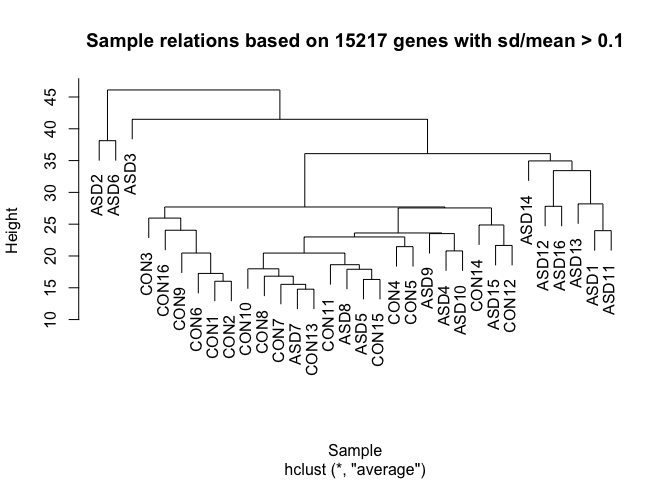

# GSE28521_Preprocessing by CS


```r
source("http://bioconductor.org/biocLite.R")
```

```
## Bioconductor version 3.0 (BiocInstaller 1.16.2), ?biocLite for help
```

```r
biocLite()
```

```
## BioC_mirror: http://bioconductor.org
## Using Bioconductor version 3.0 (BiocInstaller 1.16.2), R version 3.1.3.
## Old packages: 'formatR', 'GenomicFeatures', 'highr', 'lattice',
##   'manipulate', 'mgcv', 'mime', 'rtracklayer', 'xps'
```

```r
# biocLite("GEOquery") 
# biocLite('lumi')
# biocLite('WGCNA')
```


```r
library(GEOquery)
```

```
## Loading required package: Biobase
## Loading required package: BiocGenerics
## Loading required package: parallel
## 
## Attaching package: 'BiocGenerics'
## 
## The following objects are masked from 'package:parallel':
## 
##     clusterApply, clusterApplyLB, clusterCall, clusterEvalQ,
##     clusterExport, clusterMap, parApply, parCapply, parLapply,
##     parLapplyLB, parRapply, parSapply, parSapplyLB
## 
## The following object is masked from 'package:stats':
## 
##     xtabs
## 
## The following objects are masked from 'package:base':
## 
##     anyDuplicated, append, as.data.frame, as.vector, cbind,
##     colnames, do.call, duplicated, eval, evalq, Filter, Find, get,
##     intersect, is.unsorted, lapply, Map, mapply, match, mget,
##     order, paste, pmax, pmax.int, pmin, pmin.int, Position, rank,
##     rbind, Reduce, rep.int, rownames, sapply, setdiff, sort,
##     table, tapply, union, unique, unlist, unsplit
## 
## Welcome to Bioconductor
## 
##     Vignettes contain introductory material; view with
##     'browseVignettes()'. To cite Bioconductor, see
##     'citation("Biobase")', and for packages 'citation("pkgname")'.
## 
## Setting options('download.file.method.GEOquery'='auto')
```

```r
library(lumi)
```


## 2. Rawdata download

###- http://www.ncbi.nlm.nih.gov/geo/


```r
### Change working directory
getwd()
```

```
## [1] "/Users/neurochoi/Study/BioNetwork/GSE28521"
```

```r
setwd("~/Study/BioNetwork/")

### Download GSE dataset
# getGEOSuppFiles("GSE28521")

### Unzip dataset
setwd("GSE28521")
# system("gunzip GSE28521_non-normalized_data.txt.gz")
# system("tar xvf GSE28521_RAW.tar")
getwd()
```

```
## [1] "/Users/neurochoi/Study/BioNetwork/GSE28521"
```


```r
filename <- "GSE28521_non-normalized_data.txt"
data.lumi <- lumiR(filename)
```

```
## Perform Quality Control assessment of the LumiBatch object ...
```

```r
sampleKey_F <- read.csv("SampleDescription_F.csv")


## data structure
summary(data.lumi, 'QC')
```

```
## Data dimension:  24526 genes x 79 samples 
## 
## Summary of Samples:
##                         4936551012_A 4936551012_B 4936551012_C
## mean                          9.1640       9.1710       9.3790
## standard deviation            1.6580       1.6830       1.6100
## detection rate(0.01)          0.4007       0.4259       0.3922
## distance to sample mean      44.6300      48.3100      71.7400
##                         4936551012_D 4936551012_F 4936551012_G
## mean                          9.1770       8.9340       9.3150
## standard deviation            1.6990       1.5580       1.6090
## detection rate(0.01)          0.4254       0.4016       0.4037
## distance to sample mean      49.1900      85.4500      77.5700
##                         4936551012_H 4936551003_A 4936551003_B
## mean                          9.8540       9.2610       9.5820
## standard deviation            1.5680       1.6450       1.7200
## detection rate(0.01)          0.3357       0.4334       0.4226
## distance to sample mean     123.3000      41.0900      83.6400
##                         4936551003_C 4936551003_D 4936551003_E
## mean                          8.9510       9.1370       8.8590
## standard deviation            1.6790       1.6770       1.6300
## detection rate(0.01)          0.4433       0.4076       0.4171
## distance to sample mean      72.0100      39.6200      57.3100
##                         4936551003_F 4936551011_A 4936551011_B
## mean                          8.7990       8.8990       8.8180
## standard deviation            1.6210       1.6560       1.5200
## detection rate(0.01)          0.4281       0.4158       0.3679
## distance to sample mean      85.5900      61.9100      81.4200
##                         4936551011_F 4936551011_G 4936551011_H
## mean                          9.2030       9.2050       9.6260
## standard deviation            1.6160       1.5930       1.5760
## detection rate(0.01)          0.4103       0.4116       0.3458
## distance to sample mean      63.4600      42.7000      86.0600
##                         4936551002_D 4936551013_A 4936551013_C
## mean                          9.3590       9.2760       8.3470
## standard deviation            1.6080       1.6710       1.4490
## detection rate(0.01)          0.4208       0.4332       0.3524
## distance to sample mean      52.3500      66.0500     155.0000
##                         4936551013_D 4936551013_E 4936551013_G
## mean                          8.9710       8.7970       8.2530
## standard deviation            1.6140       1.6280       1.3880
## detection rate(0.01)          0.4155       0.4092       0.3116
## distance to sample mean      52.3400      71.9800     160.6000
##                         4936551013_H 4936551008_A 4936551008_B
## mean                          8.9270       9.3290       8.9920
## standard deviation            1.5740       1.6870       1.5690
## detection rate(0.01)          0.3779       0.4273       0.3843
## distance to sample mean      74.0700      56.8200      55.3600
##                         4936551008_C 4936551008_G 4936551008_H
## mean                          9.3450       8.8890       9.3900
## standard deviation            1.6820       1.5680       1.6910
## detection rate(0.01)          0.4127       0.3724       0.4098
## distance to sample mean      76.2900      93.1300      62.9400
##                         4936551010_D 4936551010_G 4936551010_H
## mean                          9.1900       9.2690       9.4230
## standard deviation            1.6930       1.6110       1.6440
## detection rate(0.01)          0.4219       0.4257       0.4067
## distance to sample mean      41.0400      51.0300      62.8200
##                         4936551005_A 4936551005_B 4936551005_C
## mean                           9.553       9.4350       9.0830
## standard deviation             1.636       1.6170       1.6100
## detection rate(0.01)           0.389       0.4081       0.4107
## distance to sample mean       74.920      58.9500      62.0400
##                         4936551005_D 4936551005_E 4936551005_F
## mean                          9.2790       9.1590       8.9380
## standard deviation            1.6490       1.6240       1.5670
## detection rate(0.01)          0.4158       0.4297       0.4015
## distance to sample mean      41.3800      37.9600      70.3100
##                         4936551005_H 4936551031_A 4936551031_B
## mean                          9.5490       9.1210       9.0450
## standard deviation            1.6060       1.5550       1.5250
## detection rate(0.01)          0.4115       0.3634       0.3195
## distance to sample mean      73.3300      61.6400      75.1300
##                         4936551031_D 4936551031_E 4936551031_F
## mean                          9.5320       9.4000       9.3900
## standard deviation            1.7020       1.6620       1.6470
## detection rate(0.01)          0.4167       0.4188       0.3998
## distance to sample mean      74.0200      52.9900      73.5500
##                         4936551031_H 4936551007_A 4936551007_B
## mean                          9.1820       9.4470       9.3720
## standard deviation            1.5430       1.6810       1.6930
## detection rate(0.01)          0.3654       0.4144       0.4102
## distance to sample mean      52.6300      65.5900      58.9900
##                         4936551007_C 4936551007_D 4936551007_E
## mean                          9.3190       9.3050       9.1140
## standard deviation            1.6460       1.6920       1.6470
## detection rate(0.01)          0.4291       0.4253       0.4178
## distance to sample mean      73.6600      51.2300      40.1800
##                         4936551007_F 4936551007_G 4936551006_A
## mean                          9.0480       9.2040        8.911
## standard deviation            1.6630       1.6590        1.505
## detection rate(0.01)          0.4283       0.4251        0.308
## distance to sample mean      69.4400      43.1600       70.070
##                         4936551006_C 4936551006_D 4936551006_E
## mean                          8.9740       9.1030       8.8690
## standard deviation            1.5490       1.6440       1.5780
## detection rate(0.01)          0.3607       0.4136       0.3938
## distance to sample mean      74.2800      34.5800      57.1800
##                         4936551006_F 4936551006_G 4936551015_A
## mean                          8.9070       9.1570       9.2830
## standard deviation            1.5200       1.5970       1.6300
## detection rate(0.01)          0.3789       0.4139       0.4135
## distance to sample mean      79.2900      36.0600      50.8900
##                         4936551015_B 4936551015_D 4936551015_E
## mean                          9.1920       9.3680       8.9540
## standard deviation            1.6580       1.6650       1.6610
## detection rate(0.01)          0.3997       0.4055       0.4118
## distance to sample mean      48.5000      51.7500      51.7500
##                         4936551015_F 4936551015_G 4936551015_H
## mean                          9.1860       9.0230       9.2860
## standard deviation            1.6910       1.6300       1.5450
## detection rate(0.01)          0.4289       0.4076       0.3506
## distance to sample mean      73.9200      59.1500      46.9800
##                         4936551004_A 4936551004_B 4936551004_C
## mean                          9.2350       9.2090       9.3050
## standard deviation            1.6820       1.6680       1.6640
## detection rate(0.01)          0.4268       0.4004       0.4238
## distance to sample mean      55.1700      55.6400      65.6200
##                         4936551004_D 4936551004_E 4936551004_F
## mean                          9.3720       9.4270        9.060
## standard deviation            1.7110       1.6690        1.616
## detection rate(0.01)          0.4221       0.4234        0.430
## distance to sample mean      56.0300      58.2900       65.600
##                         4936551004_H 4936551014_A 4936551014_B
## mean                          9.2750       8.8100       8.9650
## standard deviation            1.6520       1.6150       1.5970
## detection rate(0.01)          0.4243       0.3942       0.3919
## distance to sample mean      45.6100      71.2000      56.2500
##                         4936551014_D 4936551014_E 4936551014_F
## mean                          9.3500       8.9490       9.1160
## standard deviation            1.6970       1.5640       1.6570
## detection rate(0.01)          0.4267       0.4097       0.4443
## distance to sample mean      53.1200      64.5900      71.8400
##                         4936551014_G
## mean                           8.399
## standard deviation             1.387
## detection rate(0.01)           0.331
## distance to sample mean      144.300
## 
## Major Operation History:
##             submitted            finished
## 1 2015-04-03 16:03:29 2015-04-03 16:04:01
## 2 2015-04-03 16:04:01 2015-04-03 16:04:02
##                                                                command
## 1                            lumiR("GSE28521_non-normalized_data.txt")
## 2 lumiQ(x.lumi = x.lumi, detectionTh = detectionTh, verbose = verbose)
##   lumiVersion
## 1      2.18.0
## 2      2.18.0
```

```r
str(data.lumi)
```

```
## Formal class 'LumiBatch' [package "lumi"] with 10 slots
##   ..@ history          :'data.frame':	2 obs. of  4 variables:
##   .. ..$ submitted  : chr [1:2] "2015-04-03 16:03:29" "2015-04-03 16:04:01"
##   .. ..$ finished   : chr [1:2] "2015-04-03 16:04:01" "2015-04-03 16:04:02"
##   .. ..$ command    : chr [1:2] "lumiR(\"GSE28521_non-normalized_data.txt\")" "lumiQ(x.lumi = x.lumi, detectionTh = detectionTh, verbose = verbose)"
##   .. ..$ lumiVersion: chr [1:2] "2.18.0" "2.18.0"
##   ..@ controlData      :'data.frame':	0 obs. of  0 variables
##   ..@ QC               :List of 3
##   .. ..$ BeadStudioSummary:'data.frame':	0 obs. of  0 variables
##   .. ..$ sampleSummary    : num [1:4, 1:79] 9.164 1.658 0.401 44.63 9.171 ...
##   .. .. ..- attr(*, "dimnames")=List of 2
##   .. .. .. ..$ : chr [1:4] "mean" "standard deviation" "detection rate(0.01)" "distance to sample mean"
##   .. .. .. ..$ : chr [1:79] "4936551012_A" "4936551012_B" "4936551012_C" "4936551012_D" ...
##   .. ..$ history          :'data.frame':	2 obs. of  4 variables:
##   .. .. ..$ submitted  : chr [1:2] "2015-04-03 16:03:29" "2015-04-03 16:04:01"
##   .. .. ..$ finished   : chr [1:2] "2015-04-03 16:04:01" "2015-04-03 16:04:02"
##   .. .. ..$ command    : chr [1:2] "lumiR(\"GSE28521_non-normalized_data.txt\")" "lumiQ(x.lumi = x.lumi, detectionTh = detectionTh, verbose = verbose)"
##   .. .. ..$ lumiVersion: chr [1:2] "2.18.0" "2.18.0"
##   ..@ experimentData   :Formal class 'MIAME' [package "Biobase"] with 13 slots
##   .. .. ..@ name             : chr ""
##   .. .. ..@ lab              : chr ""
##   .. .. ..@ contact          : chr ""
##   .. .. ..@ title            : chr ""
##   .. .. ..@ abstract         : chr ""
##   .. .. ..@ url              : chr ""
##   .. .. ..@ pubMedIds        : chr ""
##   .. .. ..@ samples          : list()
##   .. .. ..@ hybridizations   : list()
##   .. .. ..@ normControls     : list()
##   .. .. ..@ preprocessing    : list()
##   .. .. ..@ other            :List of 1
##   .. .. .. ..$ Data File Information: NULL
##   .. .. ..@ .__classVersion__:Formal class 'Versions' [package "Biobase"] with 1 slot
##   .. .. .. .. ..@ .Data:List of 2
##   .. .. .. .. .. ..$ : int [1:3] 1 0 0
##   .. .. .. .. .. ..$ : int [1:3] 1 1 0
##   ..@ assayData        :<environment: 0x7f91f8d96e28> 
##   ..@ phenoData        :Formal class 'AnnotatedDataFrame' [package "Biobase"] with 4 slots
##   .. .. ..@ varMetadata      :'data.frame':	1 obs. of  1 variable:
##   .. .. .. ..$ labelDescription: chr "The unique Illumina microarray Id"
##   .. .. ..@ data             :'data.frame':	79 obs. of  1 variable:
##   .. .. .. ..$ sampleID: chr [1:79] "4936551012_A" "4936551012_B" "4936551012_C" "4936551012_D" ...
##   .. .. ..@ dimLabels        : chr [1:2] "sampleNames" "sampleColumns"
##   .. .. ..@ .__classVersion__:Formal class 'Versions' [package "Biobase"] with 1 slot
##   .. .. .. .. ..@ .Data:List of 1
##   .. .. .. .. .. ..$ : int [1:3] 1 1 0
##   ..@ featureData      :Formal class 'AnnotatedDataFrame' [package "Biobase"] with 4 slots
##   .. .. ..@ varMetadata      :'data.frame':	1 obs. of  1 variable:
##   .. .. .. ..$ labelDescription: chr "The Illumina microarray identifier"
##   .. .. ..@ data             :'data.frame':	24526 obs. of  1 variable:
##   .. .. .. ..$ PROBE_ID: chr [1:24526] "ILMN_1809034" "ILMN_1660305" "ILMN_1762337" "ILMN_2055271" ...
##   .. .. ..@ dimLabels        : chr [1:2] "featureNames" "featureColumns"
##   .. .. ..@ .__classVersion__:Formal class 'Versions' [package "Biobase"] with 1 slot
##   .. .. .. .. ..@ .Data:List of 1
##   .. .. .. .. .. ..$ : int [1:3] 1 1 0
##   ..@ annotation       : chr(0) 
##   ..@ protocolData     :Formal class 'AnnotatedDataFrame' [package "Biobase"] with 4 slots
##   .. .. ..@ varMetadata      :'data.frame':	0 obs. of  1 variable:
##   .. .. .. ..$ labelDescription: chr(0) 
##   .. .. ..@ data             :'data.frame':	79 obs. of  0 variables
##   .. .. ..@ dimLabels        : chr [1:2] "sampleNames" "sampleColumns"
##   .. .. ..@ .__classVersion__:Formal class 'Versions' [package "Biobase"] with 1 slot
##   .. .. .. .. ..@ .Data:List of 1
##   .. .. .. .. .. ..$ : int [1:3] 1 1 0
##   ..@ .__classVersion__:Formal class 'Versions' [package "Biobase"] with 1 slot
##   .. .. ..@ .Data:List of 4
##   .. .. .. ..$ : int [1:3] 3 1 1
##   .. .. .. ..$ : int [1:3] 2 26 0
##   .. .. .. ..$ : int [1:3] 1 3 0
##   .. .. .. ..$ : int [1:3] 1 0 0
```

```r
dim(data.lumi)
```

```
## Features  Samples 
##    24526       79
```

```r
head(sampleNames(data.lumi))
```

```
## [1] "4936551012_A" "4936551012_B" "4936551012_C" "4936551012_D"
## [5] "4936551012_F" "4936551012_G"
```

```r
head(data.lumi)
```

```
## Summary of data information:
## 	 Data File Information:
## 		
## 
## Major Operation History:
##             submitted            finished
## 1 2015-04-03 16:03:29 2015-04-03 16:04:01
## 2 2015-04-03 16:04:01 2015-04-03 16:04:02
## 3 2015-04-03 16:04:02 2015-04-03 16:04:02
##                                                                command
## 1                            lumiR("GSE28521_non-normalized_data.txt")
## 2 lumiQ(x.lumi = x.lumi, detectionTh = detectionTh, verbose = verbose)
## 3                                           Subsetting 24526 features.
##   lumiVersion
## 1      2.18.0
## 2      2.18.0
## 3      2.18.0
## 
## Object Information:
## LumiBatch (storageMode: lockedEnvironment)
## assayData: 1 features, 79 samples 
##   element names: beadNum, detection, exprs, se.exprs 
## protocolData: none
## phenoData
##   sampleNames: 4936551012_A 4936551012_B ... 4936551014_G (79
##     total)
##   varLabels: sampleID
##   varMetadata: labelDescription
## featureData
##   featureNames: ILMN_1809034
##   fvarLabels: PROBE_ID
##   fvarMetadata: labelDescription
## experimentData: use 'experimentData(object)'
## Annotation:  
## Control Data: N/A
## QC information: Please run summary(x, 'QC') for details!
```

```r
head(sampleKey_F)
```

```
##        AN Brain.area       Chip Array GEO_SampleName    GEO_GSM
## 1 AN12457      FALSE 4936551015     A   4936551015_A GSM706413 
## 2 AN17138      FALSE 4936551031     A   4936551031_A GSM706416 
## 3 AN16115      FALSE 4936551006     A   4936551006_A GSM706414 
## 4 AN16641      FALSE 4936551007     A   4936551007_A GSM706415 
## 5 AN08166      FALSE 4936551012     A   4936551012_A GSM706422 
## 6 AN09730      FALSE 4936551013     G   4936551013_G GSM706425 
##     GEO_title A.C Sex Age RIN   PMI Seizures PsyMed CODseizure
## 1 A_AN12457_F   A   F  29 8.4 17.83      yes     no        yes
## 2 A_AN17138_F   A   M  16 6.1    NA      yes    yes        yes
## 3 A_AN16115_F   A   F  11 5.0 12.88      yes     no        yes
## 4 A_AN16641_F   A   M   9 7.1 27.00      yes    yes        yes
## 5 A_AN08166_F   A   M  29 5.8 43.25      yes    yes        yes
## 6 A_AN09730_F   A   M  22 5.6 25.00      yes    yes        yes
##                         CauseOfDeath
## 1                           epilepsy
## 2                            seizure
## 3                   drowning,Seizure
## 4                            seizure
## 5              NA(seizure suspected)
## 6 anoxia,aspiration 2nd to a seizure
```

```r
## sampleNames, featureNames == rownames, colnames

## Quadrate the position of SampleName 
matchSN <- match(sampleKey_F$GEO_SampleName, sampleNames(data.lumi))
matchSN
```

```
##  [1] 60 41 54 47  1 24  8 67 34 26 14 20 74 65 59 32 62 43 66 73 19 11 70
## [24] 37 56 50 22 76 31  4 30 18
```

```r
## Assign the color following phenotypes (ASD, CON) 
colPhenotype <- as.character(sampleKey_F$A.C)
colPhenotype 
```

```
##  [1] "A" "A" "A" "A" "A" "A" "A" "A" "A" "A" "A" "A" "A" "A" "A" "A" "C"
## [18] "C" "C" "C" "C" "C" "C" "C" "C" "C" "C" "C" "C" "C" "C" "C"
```

```r
colPhenotype[which(colPhenotype[]=="A")]="red"
colPhenotype[which(colPhenotype[]=="C")]="blue"

## data.lumi -> sampleKey_F : matching
data_FCTX <- data.lumi[,matchSN]
sampleNames(data_FCTX)
```

```
##  [1] "4936551015_A" "4936551031_A" "4936551006_A" "4936551007_A"
##  [5] "4936551012_A" "4936551013_G" "4936551003_A" "4936551004_A"
##  [9] "4936551005_A" "4936551008_A" "4936551011_A" "4936551013_A"
## [13] "4936551014_A" "4936551015_G" "4936551006_G" "4936551010_G"
## [17] "4936551015_D" "4936551031_D" "4936551015_H" "4936551004_H"
## [21] "4936551002_D" "4936551003_D" "4936551004_D" "4936551005_D"
## [25] "4936551006_D" "4936551007_D" "4936551013_D" "4936551014_D"
## [29] "4936551010_D" "4936551012_D" "4936551008_H" "4936551011_H"
```

```r
sampleNames(data_FCTX)[1:16] <- c("ASD1", "ASD2", "ASD3", "ASD4", "ASD5",
                                  "ASD6", "ASD7", "ASD8", "ASD9", "ASD10",
                                  "ASD11", "ASD12", "ASD13", "ASD14",
                                  "ASD15", "ASD16")
sampleNames(data_FCTX)[17:32] <- c("CON1", "CON2", "CON3", "CON4", "CON5",
                                   "CON6", "CON7", "CON8", "CON9", 
                                   "CON10", "CON11", "CON12", "CON13",
                                   "CON14", "CON15", "CON16")

sampleNames(data_FCTX)
```

```
##  [1] "ASD1"  "ASD2"  "ASD3"  "ASD4"  "ASD5"  "ASD6"  "ASD7"  "ASD8" 
##  [9] "ASD9"  "ASD10" "ASD11" "ASD12" "ASD13" "ASD14" "ASD15" "ASD16"
## [17] "CON1"  "CON2"  "CON3"  "CON4"  "CON5"  "CON6"  "CON7"  "CON8" 
## [25] "CON9"  "CON10" "CON11" "CON12" "CON13" "CON14" "CON15" "CON16"
```


## 3. Plotting using non-nomalized data


```r
plot(data_FCTX, what="density")
```

 

```r
plot(data_FCTX, what="cv")
```

 

```r
plot(data_FCTX, what="boxplot", col=colPhenotype)
```

 

```r
plot(data_FCTX, what="sampleRelation", method="cluster")
```

 

```r
plot(data_FCTX, what="sampleRelation", method="mds", col=colPhenotype)
```

 


## 4. Normalization


```r
## log2 transformation and normalization
dataFCTX_lumiNQ <- lumiExpresso(data_FCTX, QC.evaluation=TRUE)
```

```
## Background Correction: bgAdjust 
## Variance Stabilizing Transform method: vst 
## Normalization method: quantile 
## 
## 
## Background correction ...
## Perform bgAdjust background correction ...
## There is no control probe information in the LumiBatch object!
##  No background adjustment will be performed.
## done.
## 
## Variance stabilizing ...
## Perform vst transformation ...
## 2015-04-03 16:04:06 , processing array  1 
## 2015-04-03 16:04:06 , processing array  2 
## 2015-04-03 16:04:06 , processing array  3 
## 2015-04-03 16:04:06 , processing array  4 
## 2015-04-03 16:04:06 , processing array  5 
## 2015-04-03 16:04:06 , processing array  6 
## 2015-04-03 16:04:06 , processing array  7 
## 2015-04-03 16:04:06 , processing array  8 
## 2015-04-03 16:04:06 , processing array  9 
## 2015-04-03 16:04:06 , processing array  10 
## 2015-04-03 16:04:06 , processing array  11 
## 2015-04-03 16:04:06 , processing array  12 
## 2015-04-03 16:04:06 , processing array  13 
## 2015-04-03 16:04:06 , processing array  14 
## 2015-04-03 16:04:06 , processing array  15 
## 2015-04-03 16:04:06 , processing array  16 
## 2015-04-03 16:04:06 , processing array  17 
## 2015-04-03 16:04:06 , processing array  18 
## 2015-04-03 16:04:06 , processing array  19 
## 2015-04-03 16:04:06 , processing array  20 
## 2015-04-03 16:04:06 , processing array  21 
## 2015-04-03 16:04:06 , processing array  22 
## 2015-04-03 16:04:06 , processing array  23 
## 2015-04-03 16:04:06 , processing array  24 
## 2015-04-03 16:04:06 , processing array  25 
## 2015-04-03 16:04:07 , processing array  26 
## 2015-04-03 16:04:07 , processing array  27 
## 2015-04-03 16:04:07 , processing array  28 
## 2015-04-03 16:04:07 , processing array  29 
## 2015-04-03 16:04:07 , processing array  30 
## 2015-04-03 16:04:07 , processing array  31 
## 2015-04-03 16:04:07 , processing array  32 
## done.
## 
## Normalizing ...
## Perform quantile normalization ...
## done.
## 
## Quality control after preprocessing ...
## Perform Quality Control assessment of the LumiBatch object ...
## done.
```


## 5. Plotting using normalized data


```r
plot(dataFCTX_lumiNQ, what="boxplot", col=colPhenotype)
```

 

```r
plot(dataFCTX_lumiNQ, what="density")
```

 

```r
plot(dataFCTX_lumiNQ, what="cv")
```

 

```r
plot(dataFCTX_lumiNQ, what="sampleRelation", method="cluster")
```

 

```r
plot(dataFCTX_lumiNQ, what="sampleRelation", method="mds", col=colPhenotype)
```

 


## 6. Sample Selection


```r
Resamp_lumiNQ <- dataFCTX_lumiNQ[,c("ASD4", "ASD9", "ASD10", "CON1", "CON2", "CON6")]

plot(Resamp_lumiNQ, what="boxplot", col=c(rep("red",3), rep("blue", 3)))
```

 

```r
plot(Resamp_lumiNQ , what="density", col=c(rep("red",3), rep("blue", 3)))
```

 

```r
plot(Resamp_lumiNQ , what="sampleRelation", method="cluster")
```

 

```r
plot(Resamp_lumiNQ , what="sampleRelation", method="mds", col=c(rep("red",3), rep("blue", 3)))
```

 

```r
MAplot(Resamp_lumiNQ, smoothScatter=TRUE)
```

 


## 7. Annotation


```r
tmp = getGEO("GPL6883",AnnotGPL=TRUE)
```

```
## File stored at: 
## /var/folders/jm/lccyf0ts1_z5sgn7_v31yyph0000gn/T//RtmpoBS1r3/GPL6883.annot.gz
```

```
## Warning in readLines(con, 1): gzfile 커넥션을 탐색하는 동안 내부에러가
## 발생했습니다
```

```
## Warning in readLines(con, 1): gzfile 커넥션을 탐색하는 동안 내부에러가
## 발생했습니다
```

```
## Warning in readLines(con, 1): gzfile 커넥션을 탐색하는 동안 내부에러가
## 발생했습니다
```

```
## Warning in readLines(con, 1): gzfile 커넥션을 탐색하는 동안 내부에러가
## 발생했습니다
```

```
## Warning in readLines(con, 1): gzfile 커넥션을 탐색하는 동안 내부에러가
## 발생했습니다
```

```
## Warning in readLines(con, 1): gzfile 커넥션을 탐색하는 동안 내부에러가
## 발생했습니다
```

```
## Warning in readLines(con, 1): gzfile 커넥션을 탐색하는 동안 내부에러가
## 발생했습니다
```

```
## Warning in readLines(con, 1): gzfile 커넥션을 탐색하는 동안 내부에러가
## 발생했습니다
```

```
## Warning in readLines(con, 1): gzfile 커넥션을 탐색하는 동안 내부에러가
## 발생했습니다
```

```
## Warning in readLines(con, 1): gzfile 커넥션을 탐색하는 동안 내부에러가
## 발생했습니다
```

```
## Warning in readLines(con, 1): gzfile 커넥션을 탐색하는 동안 내부에러가
## 발생했습니다
```

```
## Warning in readLines(con, 1): gzfile 커넥션을 탐색하는 동안 내부에러가
## 발생했습니다
```

```
## Warning in readLines(con, 1): gzfile 커넥션을 탐색하는 동안 내부에러가
## 발생했습니다
```

```
## Warning in readLines(con, 1): gzfile 커넥션을 탐색하는 동안 내부에러가
## 발생했습니다
```

```
## Warning in readLines(con, 1): gzfile 커넥션을 탐색하는 동안 내부에러가
## 발생했습니다
```

```
## Warning in readLines(con, 1): gzfile 커넥션을 탐색하는 동안 내부에러가
## 발생했습니다
```

```
## Warning in readLines(con, 1): gzfile 커넥션을 탐색하는 동안 내부에러가
## 발생했습니다
```

```
## Warning in readLines(con, 1): gzfile 커넥션을 탐색하는 동안 내부에러가
## 발생했습니다
```

```
## Warning in readLines(con, 1): gzfile 커넥션을 탐색하는 동안 내부에러가
## 발생했습니다
```

```
## Warning in readLines(con, 1): gzfile 커넥션을 탐색하는 동안 내부에러가
## 발생했습니다
```

```
## Warning in readLines(con, 1): gzfile 커넥션을 탐색하는 동안 내부에러가
## 발생했습니다
```

```
## Warning in readLines(con, 1): gzfile 커넥션을 탐색하는 동안 내부에러가
## 발생했습니다
```

```
## Warning in readLines(con, 1): gzfile 커넥션을 탐색하는 동안 내부에러가
## 발생했습니다
```

```
## Warning in readLines(con, 1): gzfile 커넥션을 탐색하는 동안 내부에러가
## 발생했습니다
```

```
## Warning in readLines(con, 1): gzfile 커넥션을 탐색하는 동안 내부에러가
## 발생했습니다
```

```
## Warning in readLines(con, 1): gzfile 커넥션을 탐색하는 동안 내부에러가
## 발생했습니다
```

```
## Warning in readLines(con, 1): gzfile 커넥션을 탐색하는 동안 내부에러가
## 발생했습니다
```

```
## Warning in readLines(con, 1): gzfile 커넥션을 탐색하는 동안 내부에러가
## 발생했습니다
```

```
## Warning in read.table(con, sep = sep, header = header, nrows = sampleRows,
## : gzfile 커넥션을 탐색하는 동안 내부에러가 발생했습니다
```

```
## Warning in read.table(con, sep = sep, header = header, nrows = sampleRows,
## : gzfile 커넥션을 탐색하는 동안 내부에러가 발생했습니다
```

```
## Warning in read.table(file = file, header = header, sep = sep, quote =
## quote, : gzfile 커넥션을 탐색하는 동안 내부에러가 발생했습니다
```

```r
map <- Table(tmp)

dim(map)
```

```
## [1] 24526    22
```

```r
names(map)
```

```
##  [1] "ID"                    "Gene title"           
##  [3] "Gene symbol"           "Gene ID"              
##  [5] "UniGene title"         "UniGene symbol"       
##  [7] "UniGene ID"            "Nucleotide Title"     
##  [9] "GI"                    "GenBank Accession"    
## [11] "Platform_CLONEID"      "Platform_ORF"         
## [13] "Platform_SPOTID"       "Chromosome location"  
## [15] "Chromosome annotation" "GO:Function"          
## [17] "GO:Process"            "GO:Component"         
## [19] "GO:Function ID"        "GO:Process ID"        
## [21] "GO:Component ID"       "Platform_SEQUENCE"
```

```r
map <- map[,-grep("GO:", names(map))] # drop GO
names(map)
```

```
##  [1] "ID"                    "Gene title"           
##  [3] "Gene symbol"           "Gene ID"              
##  [5] "UniGene title"         "UniGene symbol"       
##  [7] "UniGene ID"            "Nucleotide Title"     
##  [9] "GI"                    "GenBank Accession"    
## [11] "Platform_CLONEID"      "Platform_ORF"         
## [13] "Platform_SPOTID"       "Chromosome location"  
## [15] "Chromosome annotation" "Platform_SEQUENCE"
```

```r
map <- map[,1:3]
head(map)
```

```
##             ID                                      Gene title Gene symbol
## 1 ILMN_1722532              lysine (K)-specific demethylase 3A       KDM3A
## 2 ILMN_1708805                  nuclear receptor coactivator 3       NCOA3
## 3 ILMN_1672526             ankyrin repeat domain 57 pseudogene   LOC389834
## 4 ILMN_1703284            spire-type actin nucleation factor 2      SPIRE2
## 5 ILMN_2185604             chromosome 17 open reading frame 77    C17orf77
## 6 ILMN_1785107 nuclear transport factor 2-like export factor 2        NXT2
```

```r
rownames(map) <- map$ID
head(map)
```

```
##                        ID                                      Gene title
## ILMN_1722532 ILMN_1722532              lysine (K)-specific demethylase 3A
## ILMN_1708805 ILMN_1708805                  nuclear receptor coactivator 3
## ILMN_1672526 ILMN_1672526             ankyrin repeat domain 57 pseudogene
## ILMN_1703284 ILMN_1703284            spire-type actin nucleation factor 2
## ILMN_2185604 ILMN_2185604             chromosome 17 open reading frame 77
## ILMN_1785107 ILMN_1785107 nuclear transport factor 2-like export factor 2
##              Gene symbol
## ILMN_1722532       KDM3A
## ILMN_1708805       NCOA3
## ILMN_1672526   LOC389834
## ILMN_1703284      SPIRE2
## ILMN_2185604    C17orf77
## ILMN_1785107        NXT2
```

```r
map_new <- map[rownames(Resamp_lumiNQ),]
head(map_new)
```

```
##                        ID
## ILMN_1809034 ILMN_1809034
## ILMN_1660305 ILMN_1660305
## ILMN_1762337 ILMN_1762337
## ILMN_2055271 ILMN_2055271
## ILMN_1814316 ILMN_1814316
## ILMN_2359168 ILMN_2359168
##                                                     Gene title Gene symbol
## ILMN_1809034    glutamyl-tRNA(Gln) amidotransferase, subunit C        GATC
## ILMN_1660305                              phosphodiesterase 12       PDE12
## ILMN_1762337           metastasis associated in colon cancer 1       MACC1
## ILMN_2055271                            alpha-1-B glycoprotein        A1BG
## ILMN_1814316 RNA binding protein, fox-1 homolog (C. elegans) 1      RBFOX1
## ILMN_2359168 RNA binding protein, fox-1 homolog (C. elegans) 1      RBFOX1
```

```r
identical(rownames(map_new), rownames(Resamp_lumiNQ))
```

```
## [1] TRUE
```

```r
Resamp_lumiNQ <- exprs(Resamp_lumiNQ)
head(Resamp_lumiNQ)
```

```
##                   ASD4      ASD9     ASD10      CON1      CON2      CON6
## ILMN_1809034  9.024746  8.528206  8.670555  8.802473  8.848554  8.498980
## ILMN_1660305  9.641773  9.721622  9.812939  9.770373  9.857230 10.030322
## ILMN_1762337  8.202238  8.271332  8.296198  8.283088  8.320767  8.343154
## ILMN_2055271  8.396732  8.500302  8.401248  8.713424  8.408196  8.461209
## ILMN_1814316 10.883035 11.079732 10.844028 11.200983 11.120638 11.284302
## ILMN_2359168 10.908799 11.116369 10.580722 11.098101 11.139998 11.190892
```

```r
Norm_GSE28521 <- cbind(map_new, Resamp_lumiNQ)
head(Norm_GSE28521)
```

```
##                        ID
## ILMN_1809034 ILMN_1809034
## ILMN_1660305 ILMN_1660305
## ILMN_1762337 ILMN_1762337
## ILMN_2055271 ILMN_2055271
## ILMN_1814316 ILMN_1814316
## ILMN_2359168 ILMN_2359168
##                                                     Gene title Gene symbol
## ILMN_1809034    glutamyl-tRNA(Gln) amidotransferase, subunit C        GATC
## ILMN_1660305                              phosphodiesterase 12       PDE12
## ILMN_1762337           metastasis associated in colon cancer 1       MACC1
## ILMN_2055271                            alpha-1-B glycoprotein        A1BG
## ILMN_1814316 RNA binding protein, fox-1 homolog (C. elegans) 1      RBFOX1
## ILMN_2359168 RNA binding protein, fox-1 homolog (C. elegans) 1      RBFOX1
##                   ASD4      ASD9     ASD10      CON1      CON2      CON6
## ILMN_1809034  9.024746  8.528206  8.670555  8.802473  8.848554  8.498980
## ILMN_1660305  9.641773  9.721622  9.812939  9.770373  9.857230 10.030322
## ILMN_1762337  8.202238  8.271332  8.296198  8.283088  8.320767  8.343154
## ILMN_2055271  8.396732  8.500302  8.401248  8.713424  8.408196  8.461209
## ILMN_1814316 10.883035 11.079732 10.844028 11.200983 11.120638 11.284302
## ILMN_2359168 10.908799 11.116369 10.580722 11.098101 11.139998 11.190892
```

```r
write.csv(Norm_GSE28521, file = "normalized_GSE28521.csv", row.names = TRUE)
write.csv(map_new, file = "GSE28521_info.csv", row.names = TRUE)
```

